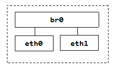
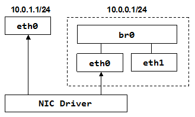
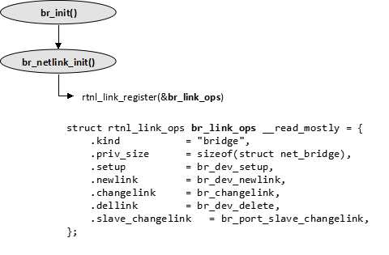
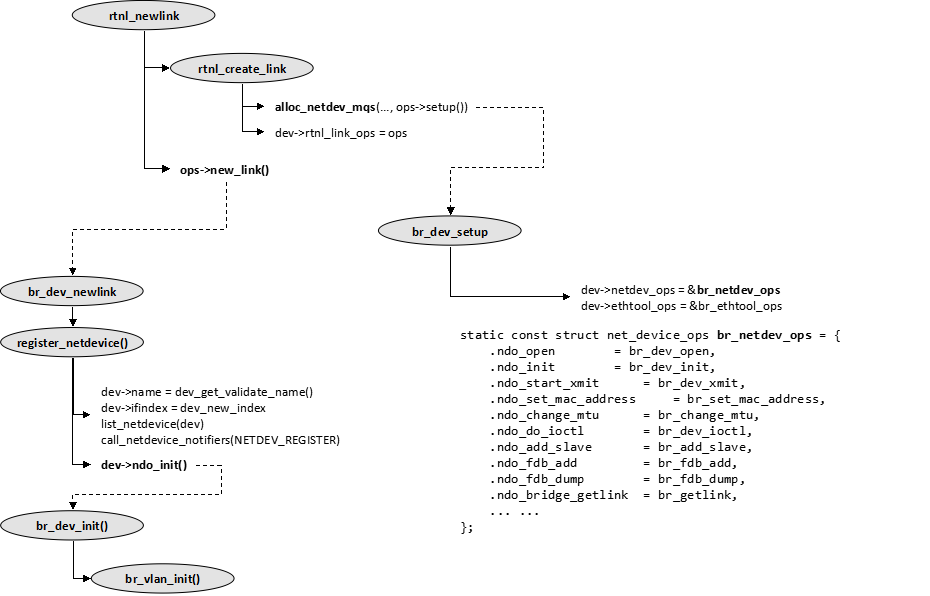
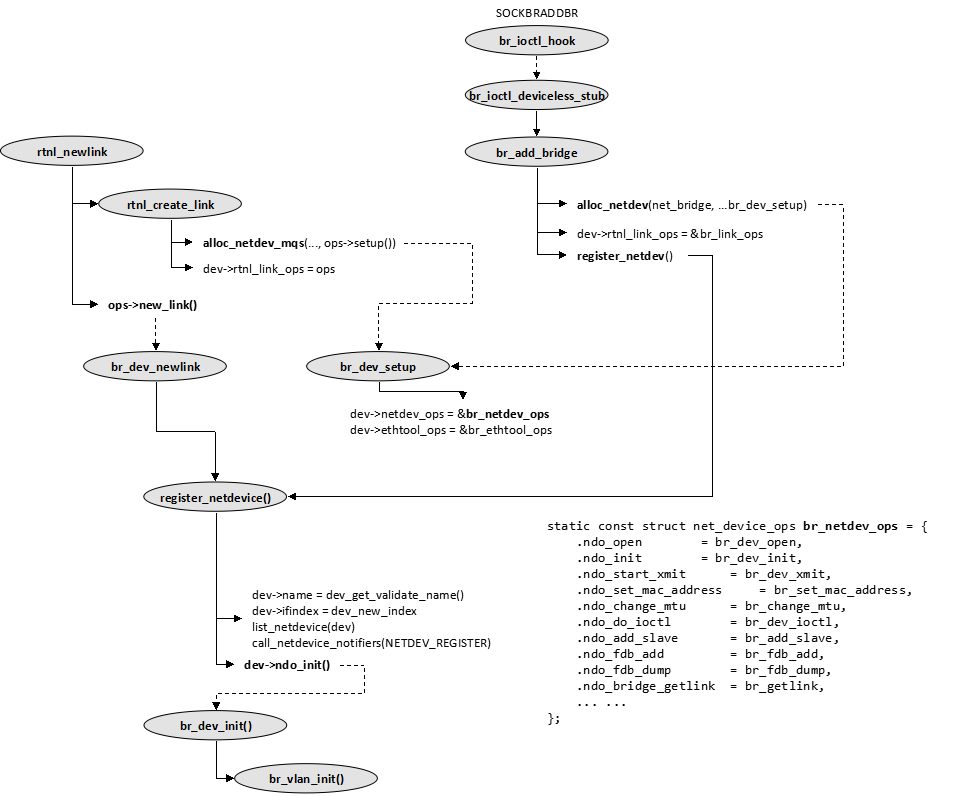
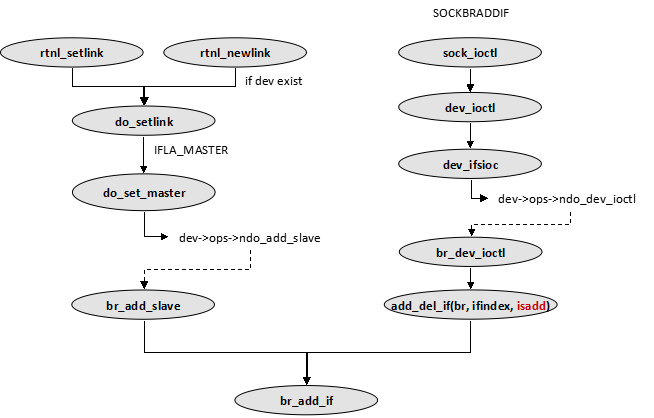

Kernel虚拟设备 之 *网桥（Bridging）*
==================================

> referencing ULNI, updated with Kernel 4.x

* [网桥虚拟设备](#br-dev)
* [数据结构](#data-struct)
  - [网桥、网桥端口及FDB关系](#br-port-fdb)
  - [转发数据库条目：net_bridge_fdb_entry{}](#fdb-entry)
  - [网桥端口：net_bridge_port{}](#br-port)
  - [网桥私有数据：net_bridge{}](#net_bridge)
* [桥接初始化](#br-init)
* [网桥设备操作](#br-oper)
  - [创建网桥设备](#br-create)
  - [添加、删除网桥端口](#br-port-add)

<a id="br-dev" />
#### 网桥虚拟设备

Linux的网桥是虚拟设备，需要将其他设备（实际或虚拟设备皆可）作为其网桥端口才能工作。将这些设备“绑定”到网桥上，或者说为网桥指定Interface的过程也称为enslave。

<div align=center></div>

网桥设备的创建使用`brctl`（或者`ip link add type bridge ...`）工具，创建后它并没有任何*网桥端口*（Interface）。

```bash
# brctl addbr br0
# brctl show
bridge name     bridge id          STP enabled     interfaces
br0             8000.000000000000           no          
```

再为它加上Interface，*网桥ID*通常会根据其第一个接口的MAC地址和默认优先级0x8生成。

```bash
# brctl addif br0 eth0
# brctl addif br0 eth1
# brctl show
bridge name     bridge id          STP enabled     interfaces
br0             8000.08002747113f           no           eth0
                                                         eth1
```

如果要让br0开始工作，需要将它打开，可能还需要为它设置个IP地址，作为网桥接口的底层设备（eth0, eth1）不需要IP地址，因为它们在L3是不可见的。设置br0 IP的方式和普通接口是一样的，可以使用`ifconfig`或者`ip`命令。

```bash
# ip link set br0 up
# ip addr add 10.0.0.1/24 dev br0 broadcast +
```

我们要注意的是网桥ID的定义：“优先级”+某个端口的MAC地址。而后来的标准中“优先级”其实只用了4位，后面12位作为系统ID扩展。

```bash
   4 bits  12 Bits                48 Bits
  +------+----------+----------------------------------+
  | Prio | SysID Ex |           MAC Address            |
  +------+----------+----------------------------------+
```

Prio使用4Bits，那么优先级的增量（每个Prio对应的Extension数目）是4096（2^12）。这样使用一个Prio和MAC标识的网桥表示4096个网桥（实例），它们可以出现在不同的网桥ID空间中。这么做并非随意为之，802.1Q允许的最大VLAN个数就是4096。那么就是说，每个VLAN所在的网桥ID空间，可以使用Prio+MAC标识一个网桥。事实上Cisco私有STP实现对SysID Ex的解释正是VLAN ID。

一旦形成了上图所示的网桥，eth0, eth1所连接的Ethernet LAN被连接成一个逻辑LAN。而Eth0,Eth1不需要分配IP地址（它们不需要在L3上可见），只需要为br0分配一个IP地址。当然不是说不能为eth0, eth1设置IP。 但如果果真的为eth0设置了IP（如下图所示，有两个eth0逻辑实例），那其NIC Driver收到包后到底直接交由IP层进行路由，还是交给br0处理，就需要使用ebtables进行流量划分了。

<div align=center></div>


<a id="data-struct" />
#### 数据结构

Bridge的实现大多位于net/bridge目录，其中桥接代码涉及的重要数据结构可以在br_private.h中找到。目录中各文件大体完成的功能总结如下。

```bash
$ tree -L 1 net/bridge/
net/bridge/
    |-- br.c                  # bridging初始化、退出，和事件处理
    |-- br_device.c           # 网桥设备操作函数，包括Setup/Free网桥，以及网桥设备的net_device_ops实现。
    |-- br_fdb.c              # FDB相关函数
    |-- br_forward.c          # 帧的转发、泛洪
    |-- br_if.c               # 添加、删除网桥、网桥端口操作“接口”实现
    |-- br_input.c            # 入口流量的处理，包括控制帧和数据流量。rx_hanlder和两个入口Netfilter HOOK函数。
    |-- br_ioctl.c            # ioctl操作相关实现，brctl(8)使用ioctl和SYSFS
    |-- br_mdb.c
    |-- br_multicast.c
    |-- br_netfilter.c        # Bridge Netfilter（ebtables）的注册和HOOK点回调函数的实现
    |-- br_netlink.c          # Netlink操作相关实现，ip(8)使用Netlink
    |-- br_notify.c           # 处理各种netdev_chain的事件（通告），例如端口UP/DOWN/MTU Change等。
    |-- br_private.h          # Bridging代码相关的 数据结构
    |-- br_private_stp.h
    |-- br_stp_bpdu.c
    |-- br_stp.c
    |-- br_stp_if.c           # STP “接口”函数实现，也就是API实现。
    |-- br_stp_timer.c
    |-- br_sysfs_br.c
    |-- br_sysfs_if.c
    |-- br_vlan.c
    |-- Kconfig
    |-- Makefile
    `-- netfilter             # Bridging相关ebtables实现。
```

先看看简单易懂的Bridge ID，Port ID和MAC地址的结构，之前已经提过Bridge ID。Port ID的情况类似，

```bash
       4 bits  12 Bits
      +------+----------+
      | Prio | Port ID  |
      +------+----------+
```

```C++
typedef struct bridge_id bridge_id;
typedef struct mac_addr mac_addr;
typedef __u16 port_id;

struct bridge_id
{
    unsigned char   prio[2];
    unsigned char   addr[6];
};

struct mac_addr
{
    unsigned char   addr[6];
};
```

<a id="br-port-fdb" />
##### 网桥、网桥端口及FDB关系

下面这张图摘自《深入理解Linux网络技术内幕》（简称ULNI），它很好的解释了网桥相关各个数据结构的关系。虽然因为Kernel的代码自该书出版以来（2.6.12）某些字段发生了变化，但是基本的关系依旧如此。

<div align=center></div>

字段变化对`net_device{}`而言，已经没有了字段`br_port`，现在用来标识一个`net_device{}`为网桥端口的字段是`priv_flags`和 `rx_handler_data`。

```c++
// net/bridge/br_if.c: 
// br_add_if()/netdev_rx_handler_register()
net_device->priv_flag       |= IFF_BRIDGE_PORT
net_device->rx_handler       = br_handle_frame()
net_device->rx_handler_data  = net_bridge_port{}
```

<a id="fdb-entry" />
##### 转发数据库条目：net_bridge_fdb_entry{}

Bridge维护一个转发数据库（Forwarding Data Base），包含了端口号，在此端口上学习到的MAC地址等信息，用于数据转发（Forwarding）。整个数据库使用Hash表组织，便于快速查找。每个网桥设备的FDB保存在其 `net_bridge->hash`中。

>`net_bridge{}`位于和`net_device`一同分配的“私有字段”中。

每个学到（或静态配置）的MAC由一个数据库的条目，即`net_bridge_fdb_entry{}`结构表示。FDB是*per-vlan*的，因为不同的VLAN的数据转发路径（可由STP生成）可能是不一样的，FDB需要记录VLAN信息。`is_local`表示MAC地址来自本地某个端口，`is_static`表示MAC地址是静态的（由用户配置或来自本地端口），这些地址不会老化。且所有本地的MAC（is_local为1）的MAC总是“静态的”。

```c++
struct net_bridge_fdb_entry
{
    struct hlist_node       hlist;  // 哈希表冲突链表节点，头是&net_bridge.hash[i]
    struct net_bridge_port  *dst;   // 条目对应的网桥端口

    unsigned long           updated;
    unsigned long           used;   // 引用计数
    mac_addr                addr;   
    __u16                   vlan_id; // MAC属于哪个VLAN
    unsigned char           is_local:1, // 是否是来自某个本地端口的MAC，本地端口总是is_static
                            is_static:1, // 是否是静态配置的MAC
                            added_by_user:1, // 用户配置
                            added_by_external_learn:1; // 外部学习
    struct rcu_head         rcu;
};
```

>FDB Per-VLAN的支持是近期（Feb 2013）才加入的，而整个Bridge的打算开始支持VLAN其实也没多久 :)。http://lwn.net/Articles/529743/ ，http://lwn.net/Articles/538877/ 。

>Briding的VLAN和Kernel由来已久的对于"虚拟VLAN设备"支持（例如eth0.100）不是一个概念。后者只需要在某个现有设备上配置VLAN虚拟设备，并且只进行Tagging/Untagging操作。但如果要在Bridging层面上支持VLAN，以为着要为每个VLAN维护STP实例（不同VLAN稳定后的转发Tree可以是不同的）和FDB，Bridge各端口见的数据转发要遵循VLAN划分，这在之前都是没有实现的。

<a id="br-port" />
##### 网桥端口：net_bridge_port{}

```c++
struct net_bridge_port
{
```

首先是Layout信息，

```c++
    struct net_bridge       *br;     // 所属网桥（反向引用）
    struct net_device       *dev;    // 网桥端口自己的net_device{}结构。
    struct list_head        list;    // 同一个Bridge的各个Port组织在链表dev.port_list中。
```

STP相关信息。STP中定义了端口的优先级，STP的各个状态（Disabled,Blocking,Learning,Forwarding）。还有“指定端口”，“根端口”，“指定网桥”的概念。同时还定义了几个定时器。这里保存了这写信息。这里不再复述STP。

```c++
    /* STP */
    u8                      priority;// 端口优先级
    u8                      state;   // 端口STP状态：Disabled，Blocking，Learning，Forwarding
    u16                     port_no; // 端口号，每个Bridge上各个端口的端口号不能改变（不能配置）
    unsigned char           topology_change_ack;// TCA ?
    unsigned char           config_pending;
    port_id                 port_id; // 端口ID：Prio+端口号
    port_id                 designated_port;
    bridge_id               designated_root;
    bridge_id               designated_bridge;
    u32                     path_cost;
    u32                     designated_cost;
    unsigned long           designated_age;

    struct timer_list       forward_delay_timer;// 转发延迟定时器，默认15s
    struct timer_list       hold_timer;       // 控制BPDU发送最大速率的定时器
    struct timer_list       message_age_timer;// BPDU老化定时器
```

Kernel通用信息 

```c++
    struct kobject          kobj;    // Kernel为了方便一些常用对象操作（添加删除等）建立的基本对象
    struct rcu_head         rcu;

    unsigned long           flags;   // 是否处于Flooding，是否Learning，是否被管理员设置了cost等

    ... IGMP Snooping & Netpoll ...

    struct net_port_vlans __rcu *vlan_info;// 在此端口上配置的VLAN信息，例如PVID，VLAN Bitmap, Tag/Untag Map
};
```

网桥端口设备本身对应的net_device{}结构中有一些字段会指示此设备为网桥端口，原先是br_port（v2.6.11）指针，新版的内核则看priv_flag是否设置 IFF_BRIDGE_PORT。如果是网桥端口的话，rx_handler_data指向net_bridge_port{}。这么做的原因自然是尽量让net_device不要放入功能特定的字段。

```c++
struct net_device {
    ... ...
                        // 如果是网桥端口IFF_BRIDGE_PORT会被设置。
    unsigned int        priv_flags; /* Like 'flags' but invisible to userspace.
                                     * See if.h for definitions. */

    ... ...
    rx_handler_func_t __rcu *rx_handler;// 创建网桥设备的时候注册为br_handle_frame()
    void __rcu      *rx_handler_data; // 如果是网桥端口，指向net_bridge_port{}
    ... ...
};
```

rx_handler是各个per-net_device的入口帧特殊处理的hook点，dev向协议栈（L3）递交skb过程，即netif_receive_skb()的处理过程中，在查询ptype_base完成L2/L3递交前，先检查各个net_device的rx_handler是不是被设置，设置的话会先调用rx_handler。而**网桥端口**设备的rx_handler是被设置的。这个是虚拟网桥如何通过端口设备收包的方式，后面会详细的讨论。

<a id="net_bridge" />
##### 网桥私有数据：net_bridge{}

虚拟的网桥本身对于Kernel也是一个网络设备，自然拥有`net_device{}`，而网桥操作相关的信息保存在`net_bridge{}`中。`net_bridge{}`作为（对dev而言）私有信息附属在`net_device{}`之后。创建网桥类型设备的时候`net_bridge{}`作为附属信息由`alloc_netdev()`一起分配。

```c++
struct net_bridge         
{
    spinlock_t          lock;
    struct list_head    port_list; // net_bridge_port{}链表
    struct net_device   *dev; // 指向网桥设备的net_device{}

    struct pcpu_sw_netstats __percpu *stats;      // 统计值，TX/Rx Packet Byte之类
    spinlock_t          hash_lock;
    struct hlist_head   hash[BR_HASH_SIZE];   // 转发数据库（FDB）哈希表
```

其中端口设备由port_list连接，FDB是per-bridge的数据库（而且per-vlan)，而非Per-port的，故保存在br结构中。考虑到FDB条目数量会比较多，查询频繁，使用Hash表保存。

> IGMP Snooping和Netfilter相关的不关注。

```c++
    ... Netfilter 相关...
    u16                     group_fwd_mask;

    /* STP */
    bridge_id               designated_root;
    bridge_id               bridge_id;
    u32                     root_path_cost;
    unsigned long           max_age;
    unsigned long           hello_time;
    unsigned long           forward_delay;
    unsigned long           bridge_max_age;
    unsigned long           ageing_time;
    unsigned long           bridge_hello_time;
    unsigned long           bridge_forward_delay;
   
    u8                      group_addr[ETH_ALEN];
    u16                     root_port;
       
    enum {
        BR_NO_STP,      /* no spanning tree */
        BR_KERNEL_STP,      /* old STP in kernel */
        BR_USER_STP,        /* new RSTP in userspace */
    } stp_enabled;

    unsigned char           topology_change;
    unsigned char           topology_change_detected;

    ... IGMP Snooping ...

    struct timer_list       hello_timer;
    struct timer_list       tcn_timer;
    struct timer_list       topology_change_timer;
    struct timer_list       gc_timer;
```

指定端口、网桥ID，路径成本，之类都能在STP协议中找到。我们从stp_enabled标识中看到STP（802.1D）的实现仍然放在Kernel中，而RSTP（Rapid STP）的实现被放在了UserSpace（Kernel以前也没有RSTP的实现）。RSTP的实现可以在这里找到：git://git.kernel.org/pub/scm/linux/kernel/git/shemminger/rstp.git。事实上把某些数据量不大但逻辑相对复杂的控制协议放到应用层的例子还是比较多的，例如IPv6的ND，DHCPv4/DHCPv6，以及未来某些nftables的某些部分。RSTP需要Kernel和Userspace“合作”完成。

```c++
    struct kobject          *ifobj;
    u32             auto_cnt;
#ifdef CONFIG_BRIDGE_VLAN_FILTERING
    u8              vlan_enabled;
    __be16              vlan_proto;
    u16             default_pvid;
    struct net_port_vlans __rcu *vlan_info; // 网桥设备和网桥端口设备一样，也可视为一个（对L3的）端口，也需要VLAN信息
#endif
};
```

<a id="br-init" />
#### 桥接初始化

桥接部分初始化和退出的代码定义在`net/bridge/br.c`中，这还有一些事件处理函数。Bridging作为一个内核模块进行初始化。

```c++
module_init(br_init)

static int __init br_init(void)
{      
    ... ...
    err = stp_proto_register(&br_stp_proto);
    ... ...
    err = br_fdb_init();
    ... ...
    err = register_pernet_subsys(&br_net_ops);
    ... ...
    err = br_netfilter_init();
    ... ...
    err = register_netdevice_notifier(&br_device_notifier);
    ... ...
    err = br_netlink_init();
    ... ...
    brioctl_set(br_ioctl_deviceless_stub);

    ... ATM 相关 ...

    return 0;

    ... 出错处理 ...
}
```

`br_init()`函数完成的工作有，

* **注册STP协议处理函数br_stp_rcv**

在net/802/stp.c中实现了个通用的STP框架，这个框架又是建立在llc之上（net/llc/），LLC显然是用来处理802.2 LLC层的，我们知道Ethernet II Packet常用于数据传输（尤其是PC端）而802.3 with 802.2 LLC协议通常用来承载STP等控制协议。LLC本身的处理和其他Ethernet PacketType(ARP, IP, IPv6..)没有不同，都是通过dev_add_pack()向netdev的ptype_base注册rcv函数。

```bash
netif_receive_skb
    +
    |- llc_rcv <= ptype_base[ETH_P_802_2]
          +
          |- br_stp_rcv <= llc_sap->rcv_func
```

* **转发数据库初始化**

为了效率的考虑`net_bridge_fdb_entry{}`的分配会在kernel cache中进行。这里使用`kmem_cache_create()`初始化一个br_fdb_cache。另外，之前提到FDB Etnry保存在`net_bridge.hash`，为了防止DoS攻击，计算Hash的时候引入一个随机因子让其计算不可预测。该因子也在此处初始化。

* **注册pernet_operations**

pernet_operation只注册了.exit函数，作用是在某个网络实例清理的时候，将所有"net"内的的bridge设备、相关Port结构、VLAN结构、Timer和FDB等清理干净。

* **初始化桥接Netfilter**

略。

* **注册通告链netdev_chain**

网桥设备是建立其他网络设备之上的，那些设备的状态（UP/DOWN），地址改变等消息会影响网桥设备（内部数据结构，如端口表，FBD等）。因此需要关注`netdev_chain`。对这些Event的处理由`br_device_event()`完成。

* **netlink操作初始化**

Bridging注册了两组Netlink的Operations，分别是AF（AF_BRIDGE）和Link级别的ops。

<a id="br-oper" />
#### 网桥设备操作

本节描述网络设备的创建、删除，打开、关闭以及网桥端口的添加、删除。

<a id="br-create" />
##### 创建网桥设备

一般创建一个新的网络设备分成2个基本步骤：

* **分配net_device{}并setup**

也就是调用`alloc_netdev_mqs(SIZE, NAME, xxx_setup)`。其中 SIZE 是附着在`net_device{}`内存后面的特定数据，对于网桥设备而言就是`net_bridge{}`的大小。`xxx_setup`则是特有设备的初始化过程。`NAME`作为创建接口名的模板，如"eth%d"、"br%d"等，稍后由`register_netdevice()`生成eth1, br0等设备名，也可直接指定。`alloc_netdev()`是alloc_netdev_mqs的wrapper，创建TX/RX队列各一个。分配时注册的`xxx_setup`会在`alloc_netdev_mqs`中被立即调用，用来初始化设备特定数据，我们之前见过`ether_setup`。

网桥对应的setup函数为`br_dev_setup()`。和ether_setup简单设置一些ethernet参数不同，`br_dev_setup`完成了许多对网桥设备至关重要的工作，例如为设备指定netdev_ops(即"dev->ndo_xxx"，用于后续的open/close/xmit）等。稍后会详细介绍。

* **注册网络设备**

函数`register_netdevice()`生成dev->name、dev->ifindex, 调用`dev.netdev_ops.ndo_init()`初始化设备，初始化输入输出队列，将设备添加到全局（net{}）设备列表，一个name为key的Hash `net.dev_name_head`，一个ifindex为key的Hash `net.dev_index_head`和，全局链表`net.dev_base_head`。

而创建网桥设备同样遵循上面的步骤。

网桥设备的操作方式有多种途径：

* ioctl，
* sysfs与
* netlink。

brctl(8)使用了ioctl/sysfs结合的方式，而ip(8)使用了较为新和通用的netlink的方式。而ioctl命令又有新旧之分，例如SIOCGIFBR/SIOCSIFBR和SIOCBRADDBR/SIOCBRDELBR。

>brctl的代码：
git://git.kernel.org/pub/scm/linux/kernel/git/shemminger/bridge-utils.git
iproute2的代码：
git://git.kernel.org/pub/scm/linux/kernel/git/shemminger/iproute2.git

不论使用ioctl,ioctl+sysfs，或者netlink，最终都会使用相同的一组底层Bridge操作接口。

###### 使用netlink创建网桥设备

初始化网桥模块的时候，注册了br_link_ops。

<div align=center></div>


当用户使用NETLINK（例如ip命令）创建一个新网桥设备的时候，网桥设备创建过程如下图所示，

<div align=center></div>


###### 使用ioctl创建网桥设备

当使用传统的ioctl创建网桥设备，例如brctl命令的时候，则从br_add_bridge()函数开始。可以看到只是call flow略有不同。实际上的工作是类似的，区别只是利用netlink框架与否而言。

<div align=center></div>


###### br_dev_setup()函数

我们有必要看看br_dev_setup()，它的实现在net/bridge/br_device.c中。

```c++
void br_dev_setup(struct net_device *dev)
{
    struct net_bridge *br = netdev_priv(dev);

    eth_hw_addr_random(dev); //生成一个随机的MAC地址
    ether_setup(dev);// 虚拟的Bridge是Ethernet类型，进行ethernet初始化（type, MTU，broadcast等）。

    dev->netdev_ops = &br_netdev_ops;   // 网桥设备的netdev_ops
    dev->destructor = br_dev_free;
    dev->ethtool_ops = &br_ethtool_ops;
    SET_NETDEV_DEVTYPE(dev, &br_type);// br_type.name = "bridge"
    dev->tx_queue_len = 0;
    dev->priv_flags = IFF_EBRIDGE;// 标识此设备为Bridge

    dev->features = COMMON_FEATURES | NETIF_F_LLTX | NETIF_F_NETNS_LOCAL |
            NETIF_F_HW_VLAN_CTAG_TX | NETIF_F_HW_VLAN_STAG_TX;
    dev->hw_features = COMMON_FEATURES | NETIF_F_HW_VLAN_CTAG_TX |
               NETIF_F_HW_VLAN_STAG_TX;      
    dev->vlan_features = COMMON_FEATURES;

    br->dev = dev;
    spin_lock_init(&br->lock);
    INIT_LIST_HEAD(&br->port_list);//初始化网桥端口链表和锁
    spin_lock_init(&br->hash_lock);

    br->bridge_id.prio[0] = 0x80;   // 默认优先级
    br->bridge_id.prio[1] = 0x00; 

    // STP相关初始化
    ether_addr_copy(br->group_addr, eth_reserved_addr_base);// 802.1D（STP）组播01:80:C2:00:00:00

    br->stp_enabled = BR_NO_STP;// 默认没有打开STP，不阻塞任何组播包。
    br->group_fwd_mask = BR_GROUPFWD_DEFAULT;
    br->group_fwd_mask_required = BR_GROUPFWD_DEFAULT;

    br->designated_root = br->bridge_id;
    br->bridge_max_age = br->max_age = 20 * HZ; // 20sec BPDU老化时间
    br->bridge_hello_time = br->hello_time = 2 * HZ;// 2sec HELLO定时器时间
    br->bridge_forward_delay = br->forward_delay = 15 * HZ;// 15sec 转发延时（用于Block->Learning->Forwardnig）
    br->ageing_time = 300 * HZ;// FDB 中保存的MAC地址的老化时间（5分钟）

    br_netfilter_rtable_init(br);    // Netfilter (ebtables)
    br_stp_timer_init(br);
    br_multicast_init(br);// 多播转发相关初始化
}
```

每个net_device有一组netdev_ops用来处理设备打开、关闭，传输等，Bridge的net_device_ops内容则更丰富一些，需要ndo_add_save, ndo_fdb_add稍后详细介绍。ethtool可用来查看链接是否UP，以及设备的信息（驱动类型，版本，固件版本，总线等）。

开始的时候网桥总是认为自己是根网桥，所有designeated_root设置成自己网桥ID。而一些STP的定时器也需要设置成默认值。有些定时器是双份的，原因是STP的Timer是由Root Bridge通告，而不是使用自己的值。但是自己也可能会成为Root，所以要维护一份自己的定时器值。

<a id="br-port-add">
#### 添加、删除网桥端口

和创建网桥设备一样，为网桥设备添加端口设备，也可以使用两种方式ioctl和netlink。

<div align=center></div>

###### br_add_if()函数

int br_add_if(struct net_bridge *br, struct net_device *dev)

端口资格检查

有几类设备不能作为网桥端口：
loopback设备
非Ethernet设备
网桥设备，即不支持“网桥的网桥”
已经作为另一个网桥设备端口的设备。每个设备只能有一个Master，否则数据去哪里呢
配置为IFF_DONT_BRIDGE的设备
   /* Don't allow bridging non-ethernet like devices */
    if ((dev->flags & IFF_LOOPBACK) ||
        dev->type != ARPHRD_ETHER || dev->addr_len != ETH_ALEN ||
        !is_valid_ether_addr(dev->dev_addr))
        return -EINVAL;

    /* No bridging of bridges */
    if (dev->netdev_ops->ndo_start_xmit == br_dev_xmit)
        return -ELOOP;

    /* Device is already being bridged */
    if (br_port_exists(dev))
        return -EBUSY;

    /* No bridging devices that dislike that (e.g. wireless) */
    if (dev->priv_flags & IFF_DONT_BRIDGE)
        return -EOPNOTSUPP;

端口结构分配和初始化

如果新的端口设备没有问题，就可以进行分配和初始化net_bridge_port{}，这几步都是new_nbp()完成。
分配一个net_bridge_port{}结构;
分配端口ID，
初始化端口成本（协议规定万兆、千兆，百兆和十兆的默认成本为2, 4, 19和100），
设置端口默认优先级，
初始化端口角色（dp）状态（blocking）。
启动STP定时器等。
    p = new_nbp(br, dev);  
    if (IS_ERR(p))
        return PTR_ERR(p); 

    call_netdevice_notifiers(NETDEV_JOIN, dev);

网桥设备需要接收所有的组播包，原来此处调用的是 dev_set_promiscuity(dev, 1)让网桥端口（可能是实际设备）工作在混杂模式，这样才能接收目的MAC非此设备的Unicast以及（未join的）所有的Multicast。现在换成了 dev_set_allmulti()。其原因可以在commit 2796d0c648c里找到。

    err = dev_set_allmulti(dev, 1);
    if (err)      
        goto put_back;

sysfs和kobj

Kernel为所有的网桥端口建立一个kobj，这样一来可以方便的使用sysfs_ops设置sysfs参数，以及其他对象操作（例如删除对象的时候，release_nbp被调用以删除net_bridge_port结构。通过，kobject_init_and_add/br_sysfs_addif实现p->kobj的初始化和注册等。一旦注册，就可以在/sys/class/net/<brname>/brif/<ifname>/找到它相应的目录。

    err = kobject_init_and_add(&p->kobj, &brport_ktype, &(dev->dev.kobj),
                   SYSFS_BRIDGE_PORT_ATTR);
    if (err)
        goto err1;

    err = br_sysfs_addif(p);
    if (err)     
        goto err2;

设备从属关系（adjacent）

略。

    err = netdev_master_upper_dev_link(dev, br->dev);
    if (err)
        goto err4;

注册rx_handler/rx_handler_data

之前介绍各个数据结构关系的时候，提到了端口设备net_device{}结构和net_bridge_port{}如何关联。即原来通过net_device->br_port的联系方式在新的实现中，已经由 priv_flags和 rx_handler_data替代。同时也提到了，netif_receive_skb()的L2/L3分用（查询ptype_base）之前，会先调用设备本身的RX处理钩子 dev->rx_handler。

         原关系图                      新关系图
       

注册rx_handler和rx_handler_data的过程有netdev_rx_handler_register完成。既然是网桥端口那么dev->priv_flags被设置上IFF_BRIDGE_PORT。同时网桥端口不支持LRO，原因是LRO（Large Receive Offload）适用于目的为Host的Packet，而网桥端口可能会转发数据到其他端口，自然就不能启用这个功能（启用了还会影响GSO）。

    err = netdev_rx_handler_register(dev, br_handle_frame, p);
    if (err)           
        goto err5;     

    dev->priv_flags |= IFF_BRIDGE_PORT;

    dev_disable_lro(dev);

添加端口设备到网桥设备端口列表

新建完一个新的端口设备，该初始化的也初始化了，现在可以加入到网桥中了。

    list_add_rcu(&p->list, &br->port_list);

设置驱动（硬件）相关Feature

之前对feature标记的设置只在软件的层次上（只是修改了dev->feature等自动），现在需要真正让设备应用这写feature。于是函数 netdev_update_features会调用ndo_set_features设置驱动，并将通告NETDEV_FEAT_CHANGE。

    netdev_update_features(br->dev);

更新FDB，初始化VLAN

网桥设备端口的MAC需要“静态”配置到FDB中，is_local和is_static同时置1。这回答了网桥端口是否有MAC地址的问题。

    if (br_fdb_insert(br, p, dev->dev_addr, 0))
        netdev_err(dev, "failed insert local address bridge forwarding table\n");
   
初始化网桥端口的VLAN配置，如果Bridge设备有“Default PVID"，就将默认PVID设置为端口的PVID并且Untag。

    if (nbp_vlan_init(p))
        netdev_err(dev, "failed to initialize vlan filtering on this port\n");

重新计算网桥MAC，Bridge ID

当一个网桥设备（不是端口设备）刚刚创建的时候，其MAC地址是随机的（见 br_dev_setup，旧实现是空MAC），这也会影响网桥ID（Prio+MAC）。当有个设备作为其端口后，是个合适的机会重新为网桥选一个MAC，并重新计算网桥ID。前提是如果这个端口的MAC合适的话，例如不是0，长度是48Bits，并且值比原来的小（STP中ID小好事，因为其他因素一样的情况下MAC愈小ID愈小，优先级就越高），就用这个端口的MAC。

    changed_addr = br_stp_recalculate_bridge_id(br);
    ... ...
    if (changed_addr)
        call_netdevice_notifiers(NETDEV_CHANGEADDR, br->dev);

设置设备状态，MTU

如果网桥端口设备是UP的，就使能它，设置状态等（如果STP没打开就没有这些步骤了）。
状态设置为Blocking，
认为自己是Designated Port（暂时）
对所有端口重新进行端口角色选择
创建端口ID
这些通过br_stp_enable_port完成，

    if (netif_running(dev) && netif_oper_up(dev) &&
        (br->dev->flags & IFF_UP))
        br_stp_enable_port(p);

接下来为新的端口设置MTU，将它设置为整个Bridge设备各个端口的最小MTU；将新端口的MAC地址记录到bridge的FDB中（per VLAN）。通过函数br_fdb_insert插入的fdb表项的is_local和is_static都是1（本地端口嘛）。

    dev_set_mtu(br->dev, br_min_mtu(br));
   
    kobject_uevent(&p->kobj, KOBJ_ADD);
   
    return 0;

    ... 出错处理，各种rollback ...
}

br_del_if基本上是br_add_if的逆过程，就不再细说了。注意一下一个端口从Bridge移走的话Bridge的ID也需要重新计算。

###### 打开、关闭网桥设备

现在已经知道用brctl（ip也一样）创建、删除网桥设备，添加、删除网桥端口时内核都发生了什么。接下来再看看打开关闭网桥设备（ifconfig xxx up/ip link set up）时都有哪些动作发生。

网桥设备也是网络设备，也有dev->ndo_open/close，所以不管是ioctl（brctl）还是netlink（ip），最终被调用的是之前在br_netdev_ops 里面所注册的br_dev_open和br_dev_close。其实Bridge的net_device_ops很多函数都已经看过了。

static const struct net_device_ops br_netdev_ops = {
    .ndo_open            = br_dev_open,       // 本节讲这个
    .ndo_stop            = br_dev_stop,       // 本节讲这个
    .ndo_init            = br_dev_init,        // 本节讲这个
    .ndo_start_xmit      = br_dev_xmit,       // 数据传输
    .ndo_get_stats64     = br_get_stats64,    // 统计，好理解
    .ndo_set_mac_address = br_set_mac_address,// 这个好理解
    .ndo_set_rx_mode     = br_dev_set_multicast_list,  
    .ndo_change_mtu      = br_change_mtu,
    .ndo_do_ioctl        = br_dev_ioctl,      // 已经提过了
    ... netpoll 相关...
    .ndo_add_slave       = br_add_slave,      // 已经提过了
    .ndo_del_slave       = br_del_slave,      // 已经提过了
    .ndo_fix_features    = br_fix_features,   // 已经提过了，见br_add_if
    .ndo_fdb_add         = br_fdb_add,
    .ndo_fdb_del         = br_fdb_delete,
    .ndo_fdb_dump        = br_fdb_dump,
    .ndo_bridge_getlink  = br_getlink,
    .ndo_bridge_setlink  = br_setlink,
    .ndo_bridge_dellink  = br_dellink,
};

br_dev_open自然是用户“up”了这个设备后被调用的。netdev_update_features之前遇到过，netif_start_queue，打开输出队列这个和普通设备没有区别（具体参考《UNLI》）。然后是Multicast和STP部分，这就不细说了。

static int br_dev_open(struct net_device *dev)
{  
    struct net_bridge *br = netdev_priv(dev);
   
    netdev_update_features(dev);
    netif_start_queue(dev);
    br_stp_enable_bridge(br);
    br_multicast_open(br);  

    return 0;
}  

br_dev_close是br_dev_open的反过程不再详述。


5. Ingress Traffic: Local Deliver & Forwarding

网桥的数据流有3个方向：
从端口接收，递交到协议栈（ingress）
从协议栈发送到端口（egress）
端口之间的转发（forwarding）
如果运行STP（RSTP）的话，不是所有端口都能转发数据，只有处于forwarding状态端口才行，但只要端口不是disable那所有的BPDU是可以接收、发送的。现在假设端口已经进入Forwarding，来看看数据接收流程（ingress flow）。

虚拟网桥设备的数据接收一定是从其端口设备开始的，不论端口是真是设备或者其他类型的虚拟设备，最后traffic总要到达 netif_receive_skb。之前提到的添加网桥端口（ br_add_if()）时会建立 net_bridge_port和端口 net_device的关系，即注册了 rx_handler和 rx_handler_data（即net_bridge_port{}）。


br_add_if()
    +
    |-netdev_rx_handler_register(dev, br_handle_frame, p);

5.1 netif_receive_skb处理rx_handler

之前还说到 netif_receive_skb将数据进行按照 ptype_base进行L2/L3递交前，会检查dev的rx_handler，如果不为空则先调用rx_handler，然后根据rx_hander的返回决定skb的去向。我们以网桥端口设备的视角看看 __netif_receive_skb_core的实现。

其中pt_prev的作用是什么呢？从ptype_base在找到匹配的Protocol后先不忙着递交，而是记录下pt_prev。等到了不得不递交的时候，即skb马上做某些处理了，再递交到上次记录下的pt_prev。那么何苦要那么费劲延迟递交呢？原因是为了减少一次kfree_skb()。http://bbs.chinaunix.net/thread-1933943-1-1.html

rx_handler的返回会决定skb的后续去向（从rx_handler_result的注释可以看到清楚的解释），
RX_HANDLER_CONSUMED 那么skb已经被rx_handler消费，不必继续处理，可以释放了。
RX_HANDLER_ANOTHER  需要进行另一轮（another_round的处理），暗示skb->dev被修改，传给了另一个net_device{}，再来一次。。
RX_HANDLER_EXACT    强制进行“确定的递交”（Exactly Deliver），不能通配递交。匹配意味着skb->dev必须和ptype->dev一样。
RX_HANDLER_PASS     就像rx_hanlder没有被调用过一样来处理skb
经过rx_handler的处理后，会根据其返回进行后续动作：结束处理，再来一遍，继续ptype_base查询与递交等。。

static int __netif_receive_skb_core(struct sk_buff *skb, bool pfmemalloc)
{
    ... ...
another_round:
    skb->skb_iif = skb->dev->ifindex;// skb的输入接口是网桥端口的ifindex

    ... VLAN, ptype_all 等 ...

    rx_handler = rcu_dereference(skb->dev->rx_handler);
    if (rx_handler) { // 网桥端口设备的rx_handler显然是被注册的
        if (pt_prev) {// 不要被pt_prev影响，它是用来优化的，可以忽略这段
            ret = deliver_skb(skb, pt_prev, orig_dev);
            pt_prev = NULL;
        }
        switch (rx_handler(&skb)) {// rx_handler处理skb，并通过返回值是后续的处理
        case RX_HANDLER_CONSUMED:
            ret = NET_RX_SUCCESS; // Bridge的rx_hanlder的数据被修改skb->dev后再次进入netif_receive_skb，原来那个netif_receive_skb返回CONSUMED
            goto unlock;
        case RX_HANDLER_ANOTHER:// skb->dev已经被修改
            goto another_round;
        case RX_HANDLER_EXACT:
            deliver_exact = true;
        case RX_HANDLER_PASS:// 就像没调用过rx_handler一样
            break;
        default:
            BUG();
        }
    }
    
    ... VLAN 等 ...

    type = skb->protocol;
    list_for_each_entry_rcu(ptype,
            &ptype_base[ntohs(type) & PTYPE_HASH_MASK], list) { // 协议层递交
        if (ptype->type == type &&
            (ptype->dev == null_or_dev || ptype->dev == skb->dev ||
             ptype->dev == orig_dev)) {
            if (pt_prev)
                ret = deliver_skb(skb, pt_prev, orig_dev);
            pt_prev = ptype;
        }
    }

    ... ...
}

5.2 网桥端口设备rx_handler: br_handle_frame

好，现在我们看看bridge端口的处理函数 br_handle_frame如何处理skb和指示后续操作。该函数位于br_input.c中。

rx_handler_result_t br_handle_frame(struct sk_buff **pskb)
{
    ... ...
    if (unlikely(skb->pkt_type == PACKET_LOOPBACK))
        return RX_HANDLER_PASS;

    if (!is_valid_ether_addr(eth_hdr(skb)->h_source))
        goto drop;

网桥端口不打算处理回环数据；源地址必须为合法Ethernet地址：源MAC地址不能是全0，不能是MAC广播和多播，是的话就丢弃。

    skb = skb_share_check(skb, GFP_ATOMIC);
    if (!skb)
        return RX_HANDLER_CONSUMED;

如果skb是共享的，考虑的网桥端口会修改skb，将它clone一份，并将原来那个sk_buff是否（原来的数据不会是否，见sbk如何共享）。

    p = br_port_get_rcu(skb->dev);

从net_device{}取出接收skb的网桥端口设备的net_bridge_port{}结构。

接下来数据被分为两类：目的地址是Link Local MAC层多播的数据包括了STP的BPDU，和普通数据。

STP帧（BPDU）和其他保留多播帧

首先是Link Local MAC多播的处理。802.1D有组保留的 Link Local 多播MAC地址，他们用于控制协议，如STP。如果接收到了STP但网桥没有开STP协议，就视为普通数据处理；换句话说，就是本网桥当作自己是不认识STP的网桥，例如Hub或不支持STP的Switch。这时需要Flood STP报文到其他端口，而保证那些支持STP网桥则看不到不支持STP设备的存在。对于其他Kernel不支持的管理帧处理方式类似。

最后能够在此函数直接递交到Local Host的只能STP功能打开情况下收到的STP帧。递交的时候经过Netfilter的NF_BR_LOCAL_IN的 HOOK点，然后是br_handle_local_finish。br_handle_local_finish的处理实际上不如说是“不处理”，它只是在端口处于Learning的情况下学习个skb的源MAC，并且总是返回0指示包 RX_HANDLER_PASS，由netif_receive_skb继续根据ptype_base处理（STP报文）。

所有这段代码对于STP的处理也只是学了个源MAC，然后继续有netif_receive_sbk处理。并没有处理STP帧（BPDU）。

    if (unlikely(is_link_local_ether_addr(dest))) { // MAC Link Local地址通常是管理帧
        ... ...
        switch (dest[5]) {
        case 0x00:  /* Bridge Group Address */// 看看STP要怎么弄法，如果真要处理的话不是在这，而是稍后的protocol dipatching（ptype_base）的地方
            /* If STP is turned off,
               then must forward to keep loop detection */
            if (p->br->stp_enabled == BR_NO_STP)
                goto forward;// 没开STP，那STP帧就和普通数据帧一样处理
            break;

        case 0x01:  /* IEEE MAC (Pause) */
            goto drop; // MAC Control帧不能通过网桥

        default:// 其他的保留MAC多播和普通数据帧一样处理
            /* Allow selective forwarding for most other protocols */
            if (p->br->group_fwd_mask & (1u << dest[5]))
                goto forward;
        }

        //如果能到达这，只有一种情况：STP功能打开的情况下，收到了STP帧
        /* Deliver packet to local host only */
        if (NF_HOOK(NFPROTO_BRIDGE, NF_BR_LOCAL_IN, skb, skb->dev,
                NULL, br_handle_local_finish)) { // br_hanle_local_finishq其实只是在Learning状态下学习MAC并返回0
            return RX_HANDLER_CONSUMED; /* consumed by filter */
        } else { // 通常，NF_HOOK(br_handle_local_finish)返回0，于是STB BPDU到此处“pass”，最后由netif_receive_skb根据ptype_base分发到STP协议层。
            *pskb = skb;
            return RX_HANDLER_PASS; /* continue processing */
        }
    }

记住，这个函数不会进行STP BPDU的处理！！

普通数据帧

走到这里的帧要么是普通数据帧，要么是被视为普通数据的控制帧。它们的处理都是一样的，就是当作普通数据处理。
普通数据帧（非STP帧BPDU），
没有打开STP功能情况下的STP帧，那么就和普通帧一样处理
要么就是其他的保留多播（非MAC Control），那么就和普通帧一样处理
ebtable可以改变L2帧在网桥中流向，甚至修改帧，称为ebt_broute，br_should_route_hook就是干这个事情的。如果没有相应的ebtable规则就不会调用rhook。这段代码表明，也只有端口处于“forwarding”状态的时候才能进行数据流向确定与修改。

forward:
    switch (p->state) {
    case BR_STATE_FORWARDING:// 这里的重点不是“Forwarding”状态下数据流量如何处理，而是只有“forwarding”状态才能处理ebt_broute，即rhook
        rhook = rcu_dereference(br_should_route_hook);
        if (rhook) {
            if ((*rhook)(skb)) {
                *pskb = skb;
                return RX_HANDLER_PASS;
            }
            dest = eth_hdr(skb)->h_dest;
        }
        /* fall through */
    case BR_STATE_LEARNING:
        if (ether_addr_equal(p->br->dev->dev_addr, dest))// 如果目的MAC和网桥设备（而不是网桥端口）的MAC相同，标记为PACKET_HOST
            skb->pkt_type = PACKET_HOST;

        NF_HOOK(NFPROTO_BRIDGE, NF_BR_PRE_ROUTING, skb, skb->dev, NULL,
            br_handle_frame_finish);
        break;
    default:
drop:
        kfree_skb(skb);
    }
   return RX_HANDLER_CONSUMED; // 注意br_handle_frame返回的是consumed
}

br_handle_frame返回的是consumed，也就是说第一次netif_receive_skb会因为rx_handler返回consumed而结束。

不是说非Fowwarding状态不能接受、转发数据吗？怎么就全部到br_handle_frame_finish了呢？先不急，看看br_handle_frame_finish的实现就知道了。

br_handle_frame分析完了，我们留下两个问题，
STP为什么在该函数中没有被处理，并且还去向了ptype_base的流程。
br_handle_frame_finish是做什么的
第一个问题其实好理解，STP作为一种特殊类型的Ethernet packet type，注册了自己的packet_type{}。在br_handler_frame的STP处理只是分流一下不该处理的情况（netif_receive_skb的流程做不到这种分流）。正经的STP处理的方法是在稍后查询ptype_base，找到相应的处理函数。

// net/llc/llc_core.c
static struct packet_type llc_packet_type __read_mostly = {
    .type = cpu_to_be16(ETH_P_802_2),
    .func = llc_rcv,
};

反观普通数据流量，普通NIC收到这些数据时应递交到协议栈，即查询ptype_base然后递交。但设备一旦作为网桥端口，就不能这么处理了，可能需要转发的其他端口什么的，所以才要走br_handler_frame及后续函数。我们看看第二个问题，br_handle_frame_finish接下来是怎么处理普通数据流量（或当作普通数据处理的保留多播流量）的。

5.3 数据帧处理：br_handle_frame_finish

本节接着br_handle_frame讨论数据帧的处理，这里的数据帧代表非（STP等）控制帧，当然也包括“视为数据帧一同处理”的控制帧（例如STP功能关闭的情况下，BPDU就视为普通数据帧处理）。后面就不再罗嗦了，统一称为“数据帧”或“数据流量”。

int br_handle_frame_finish(struct sk_buff *skb)
{
    const unsigned char *dest = eth_hdr(skb)->h_dest;
    struct net_bridge_port *p = br_port_get_rcu(skb->dev);
    ... ...
    if (!p || p->state == BR_STATE_DISABLED)
        goto drop;
       
根据STP，处于Disable状态的端口，认为是“物理”关闭的，什么流量（数据和BPDU）都不接收。 

    if (!br_allowed_ingress(p->br, nbp_get_vlan_info(p), skb, &vid)) // br_vlan.c里面的实现是“正体”
        goto drop;     

Kernel的Bridge是支持VLAN的，所以在VLAN功能打开的情况下，要看看这个端口设备是不是允许接收skb所在VLAN ID的流量（端口可以配置允许哪些VLAN通过），这点可以通过br_allowed_ingress验证。关于VLAN有一点要注意，如果端口设置了PVID，那么收到的untag的流量属于这个VLAN，并且需要打上tag。

另一方面，如果接收到skb已经包含了tag header，而且由没有设置skb->vlan_tci，则需要使用skb_vlan_untag将skb的tag去除，存放到skb->vlan_tci中。

commit 12464bb8de021a01fa7ec9299c273c247df7f198
Author: Toshiaki Makita <makita.toshiaki@lab.ntt.co.jp>
Date:   Thu Mar 27 21:46:55 2014 +0900

    bridge: Fix inabillity to retrieve vlan tags when tx offload is disabled
   
    Bridge vlan code (br_vlan_get_tag()) assumes that all frames have vlan_tci
    if they are tagged, but if vlan tx offload is manually disabled on bridge
    device and frames are sent from vlan device on the bridge device, the tags
    are embedded in skb->data and they break this assumption.
    Extract embedded vlan tags and move them to vlan_tci at ingress.

STP端口如果处于Learning和Forwarding状态，就需要学习新的源MAC（更新FDB）。 net_bridge_port里面有一个 flags，可以设置 BR_LEARNING，不过这个不是端口的状态，只表示端口需要进行学习（处于Learning或者Forwarding这个标记都会被设置，此外端口刚刚建立也会设置它（STP可能把它取消））。表示端口状态的是state字段。FDB是per-VLAN的，因为每个VLAN的STP树的拓扑可能是不同的，所以更新的时候需要VLAN ID。端口如果有PVID，那收到的untag的skb已经被加上了VLAN ID。 br_fdb_update在后面会相信讲。

还有一点要注意的是，不光光是MAC需要更新，还需要更新timer；每次收到同MAC的包就重置定时器。

    /* insert into forwarding database after filtering to avoid spoofing */
    br = p->br;
    if (p->flags & BR_LEARNING)
        br_fdb_update(br, p, eth_hdr(skb)->h_source, vid);

多播部分暂时先不谈。

    if (!is_broadcast_ether_addr(dest) && is_multicast_ether_addr(dest) &&
        br_multicast_rcv(br, p, skb))
        goto drop;

如果数据来自 br_handle_frame，那么 br_handle_frame_finish被调用的时候端口只能处于两种状态：Learning和Frowarding。所以如果端口是Learning就说明不是Forwarding，学个MAC就行了，不能继续接收数据。

    if (p->state == BR_STATE_LEARNING)
        goto drop;

sbk中有个48Bytes私有字段cb[]供各个Layer自己使用，Bridge代码入口部分用它存放br_input_skb_cb{}。不考虑IGMP Snooping的话，只有一个成员brdev，它实际上保持的是 接收这个数据帧的网桥（不是网桥端口）的net_device{}结构。我们要记住这点，同时再回顾一下另一个标记skb相关设备的地方，skb->skb_iif记录的则是网桥端口的ifindex（见 __netif_receive_skb_core）。

    BR_INPUT_SKB_CB(skb)->brdev = br->dev;

接下来是链路层广播、多播和单播的处理，这段代码出现两个skb指针：skb2和原来的skb，他们都可能指向接收的skb，或者为NULL。经处理后，如果skb2不为NULL，则需要递交到本地Host，如果skb不为NULL代表需要转发。
链路层广播：需要递交到Host，也需要转发（skb和skb2都不是NULL）
链路层多播：？？？多播转发、或递交？？？
链路层单播：查询per-VLAN的FDB，
如果目的地址是网桥的某个端口MAC之一（在所在VLAN的FDB中可以找到net_bridge_fdb_entry{}，且entry->is_local是1）则需要递交到本地（skb2 = skb），此时数据不再转发（skb = NULL）。
目的单播不是网桥某个端口的MAC，需要转发，不需要递交
除了以上情况 ，还有一种情况必须递交skb到Host：及网桥设置了混杂模式时。这里是网桥，不是网桥端口，网桥端口不用说一定是混杂模式。

    /* The packet skb2 goes to the local host (NULL to skip). */
    skb2 = NULL; // 默认不递交（如单播MAC非任何端口的MAC就属于此类）

    if (br->dev->flags & IFF_PROMISC)
        skb2 = skb;// 网桥被设置成混杂模式，这必须递交上去

    dst = NULL;

    if (is_broadcast_ether_addr(dest)) {
        skb2 = skb;// 广播必须递交到Host
        unicast = false;
    } else if (is_multicast_ether_addr(dest)) {
        mdst = br_mdb_get(br, skb, vid);
        if ((mdst || BR_INPUT_SKB_CB_MROUTERS_ONLY(skb)) &&
            br_multicast_querier_exists(br, eth_hdr(skb))) {
            if ((mdst && mdst->mglist) ||
                br_multicast_is_router(br))
                skb2 = skb;
            br_multicast_forward(mdst, skb, skb2);
            skb = NULL;
            if (!skb2)
                goto out;
        } else
            skb2 = skb;

        unicast = false;
        br->dev->stats.multicast++;
    } else if ((dst = __br_fdb_get(br, dest, vid)) &&
            dst->is_local) {
        skb2 = skb;  // 单播目的是某个端口的MAC（在VLAN内检查），递交到Host
        /* Do not forward the packet since it's local. */
        skb = NULL;
    }   

决定完是不是要转发，是不是要递交到Host，就可以正在的干活了。如果需要转发（skb不为NULL），又在FBI中找到了目的端口，就转发到改端口。否则就flooding。如果需要递交，就调用br_pass_frame_up。

    if (skb) {
        if (dst) {
            dst->used = jiffies;
            br_forward(dst->dst, skb, skb2);// 数据转发到FDB查询到的端口
        } else
            br_flood_forward(br, skb, skb2, unicast);// 数据Flood到所有端口
    }  

    if (skb2)
        return br_pass_frame_up(skb2);// 数据递交到本地Host

    ... ...
}

顺便提一下，目前为止skb->dev还么有改变，因为不能确定要交换的skb->dev是哪个，如果是本地递交，就会被替换成网桥设备，如果是转发或者flooding则需要换成对应端口设备，而且skb可能还需要再clone。

5.4 本地递交：br_pass_frame_up

进入br_pass_frame_up的skb是打算经由Bridge设备，输入到本地Host的。网桥设备本身可以视作一个port，所以离开网桥设备到协议栈的过程就网桥的视角而言属于“egress”。

static int br_pass_frame_up(struct sk_buff *skb)// 通过网桥设备（视为特殊端口），递交到Host协议栈
{
    ... 统计信息等 ...

既然数据要离开网桥，就要先看看网桥的VLAN设置只不支持这个VLAN ID。因此，除非被设置成了混杂模式，否则要查看VLAN ID。如果必要skb离开网桥的时候需要加上tag。对比之前的br_handle_frame的时候，那时作为输入Port需要查看br_allowed_ingress，现在skb要通过（网桥设备）离开网桥了，所以要查看br_allowed_egress。稍后转发的时候也是类似的逻辑。 

    /* Bridge is just like any other port.  Make sure the  // Bridge设备的处理类似其他网桥端口
     * packet is allowed except in promisc modue when someone
     * may be running packet capture.
     */
    if (!(brdev->flags & IFF_PROMISC) &&
        !br_allowed_egress(br, br_get_vlan_info(br), skb)) {
        kfree_skb(skb);
        return NET_RX_DROP;
    }  

数据包从网桥端口设备进入，经过网桥设备，然后再进入协议栈，其实是“两次经过net_device”，一次是端口设备，另一次是网桥设备。现在数据包离开网桥端口进入网桥设备，需要修改skb->dev字段。

有3个地方和skb经由的net_device相关
skb->skb_iif 
记录是入口网桥端口的ifindex （__netif_receive_skb_core）
skb->dev
起初是网桥端口设备，现在离开网桥端口进入网桥的时候，被替换为网桥设备的net_device。如果设备是TX，或者从一个端口转发的另一个skb->dev也会相应改变。不论数据的流向如何，skb->dev总是指向目前所在的net_device{}。
BR_INPUT_SKB_CB(skb)->brdev
始终是“网桥设备”的net_device。

    indev = skb->dev;
    skb->dev = brdev;

交换dev后重新进行VLAN测试，这次要决定出去的skb是否打tag，如果是untag的，则需要清空skb->vlan_tci。 

    skb = br_handle_vlan(br, br_get_vlan_info(br), skb);
    if (!skb)
        return NET_RX_DROP;

递交的最后一步是经过NF_BR_LOCAL_IN钩子点，然后是我们熟悉的netif_receive_skb，只不过这次进入该函数的时候skb->dev已经被换成了Bridge设备。这可以理解为进入了Bridge设备的处理。

    return NF_HOOK(NFPROTO_BRIDGE, NF_BR_LOCAL_IN, skb, indev, NULL,
               netif_receive_skb);
}

这点是非常重要的，我们之前在查看如何添加网桥端口（ br_add_if）的时候，发现创建网桥端口的时候，会调用 netdev_rx_handler_register(dev, br_handle_frame, p);注册rx_handler，但是对网桥设备而言，并没有注册rx_handler，所有网桥设备的数据流量走正常的Protocol Dipatching过程，查询ptype_base并递交到协议层。

以上过程即刚才所说的两次经过net_device。

Bridge Local In的数据被修改skb->dev后再次进入netif_receive_skb，原来那个netif_receive_skb因为rx_handler返回CONSUMED而结束。

5.5 数据转发到端口：br_forward

我们再看看 br_handle_frame_finish的另一个支流，转发支流，首先是转发到单个端口的情况，出现这种精确的转发，意味着FDB里面有目的MAC对应的条目，找到了目的端口。直接转发的某个端口通过函数br_forward。

先回顾一下br_handle_frame_finish的代码片段，br_forward的第一个参数是刚刚查到的目的网桥端口，第二个参数是要转发的skb，第三个则是要递交的skb，可能为空，当然如果不为NULL，和要转发的是同一个skb。

    // br_forward.c: br_handle_frame_finish()
    if (skb) {
        if (dst) {
            dst->used = jiffies;
            br_forward(dst->dst, skb, skb2); // 数据转发到FDB查询到的端口
        } else
            br_flood_forward(br, skb, skb2, unicast); // 数据Flood到所有端口
    }  

注意 br_handle_frame_finish里面的skb,skb2，到了br_forward的参数变成skb, skb0。之所以在转发的时候把“需不需要递交”也作为参数传递进来的原因是，如果skb确实需要同时转发和递交，就需要先clone一份。

转发前还需要做几个检查，必须同时满足一下条件，
不能转发给自己 （ingress/egress端口 不能相同）除非目的端口设置了HAIRPIN模式
VLAN角度运行数据离开网桥设备
端口处于Forwarding状态
设置了Hairpin模式的Port可以把frame发给自身。这么做是为了虚拟以太网端口聚集（VEPA）。具体可以参见 http://lwn.net/Articles/347344/ 。

以上检查由should_deliver()完成。如果确实可以转发，并且同时要递交这个帧（skb0不为NULL），就需要先clone一份，然后转发。deliver_clone是个helper函数，先完成clone，如果成功就调用第二个参数指定的函数来完成转发。最终的递交函数总是__br_forward()。

void br_forward(const struct net_bridge_port *to, struct sk_buff *skb, struct sk_buff *skb0)
{
    if (should_deliver(to, skb)) {
        if (skb0)
            deliver_clone(to, skb, __br_forward);
        else
            __br_forward(to, skb);
        return;           
    }      

    if (!skb0)
        kfree_skb(skb);
}   

如果不能转发，同时稍后也不需要递交到本地Host，就把数据帧释放掉。。

static void __br_forward(const struct net_bridge_port *to, struct sk_buff *skb)                                      
{           
    struct net_device *indev;
            
    if (skb_warn_if_lro(skb)) {                                                                                      
        kfree_skb(skb);
        return;
    }                                                                                                                
   
    skb = br_handle_vlan(to->br, nbp_get_vlan_info(to), skb);                                                        
    if (!skb)
        return;
       
    indev = skb->dev;                                                                                                
    skb->dev = to->dev;                                                                                              
    skb_forward_csum(skb);
       
    NF_HOOK(NFPROTO_BRIDGE, NF_BR_FORWARD, skb, indev, skb->dev,                                                     
        br_forward_finish);                                                                                          
}       

int br_forward_finish(struct sk_buff *skb)
{
    return NF_HOOK(NFPROTO_BRIDGE, NF_BR_POST_ROUTING, skb, NULL, skb->dev,
               br_dev_queue_push_xmit);

}

int br_dev_queue_push_xmit(struct sk_buff *skb)
{
    /* ip_fragment doesn't copy the MAC header */
    if (nf_bridge_maybe_copy_header(skb) ||
        !is_skb_forwardable(skb->dev, skb)) {
        kfree_skb(skb);
    } else {
        skb_push(skb, ETH_HLEN);
        br_drop_fake_rtable(skb);
        dev_queue_xmit(skb);
    }

    return 0;
}

最终，dev_queue_xmit使得skb通过网桥端口设备出去。

5.6 Flooding到各个端口：br_flood_forwards

br_flood_forwards只是函数br_flood的包裹函数（据注释说只有在拿到了bridge lock才能调用 - -）。

/* called under bridge lock */
void br_flood_forward(struct net_bridge *br, struct sk_buff *skb,
              struct sk_buff *skb2, bool unicast)
{
    br_flood(br, skb, skb2, __br_forward, unicast);
}

br_flood()遍历每个网桥端口，如果可以的话（满足刚刚说过的should_deliver的要求），就用__packet_hook（ __br_forward()）转发之。不过函数实现的时候用了一个小技巧，判断为能不能转发后先不急着转发，而是看看下一个端口，如果下一个端口也需要转发，才把数据转发到上次那个要转发到端口。这么做的原因也是减少一次clone。如果没有后续可以转发的端口，就不需要clone了。

static void br_flood(struct net_bridge *br, struct sk_buff *skb,
             struct sk_buff *skb0,
             void (*__packet_hook)(const struct net_bridge_port *p,
                       struct sk_buff *skb),
             bool unicast)
{
    struct net_bridge_port *p;
    struct net_bridge_port *prev;

    prev = NULL;

    list_for_each_entry_rcu(p, &br->port_list, list) {
        /* Do not flood unicast traffic to ports that turn it off */
        if (unicast && !(p->flags & BR_FLOOD))
            continue;
        prev = maybe_deliver(prev, p, skb, __packet_hook);
        if (IS_ERR(prev))
            goto out;
    }

    if (!prev)
        goto out;

    if (skb0)
        deliver_clone(prev, skb, __packet_hook);
    else
        __packet_hook(prev, skb);
    return;

out:
    if (!skb0)
        kfree_skb(skb);
}

skb所在端口是不会被转发的，这个由should_deliver保证。

此外br_flood也会使用__br_forward最终转发数据帧，和br_forward一样。


6. Egress Traffic: Transmit

出口流量从Host向  网桥 发送数据开始。数据帧从L3传输到L2（网络设备）的函数为dev_queue_xmit。所以直接调用dev_hard_start_xmit。

我们先不考虑输出队列、GSO和Bridge Netfilter。Bridge等虚拟设备通常没有输出队列。虽然网桥设备默认是支持GSO的，但是最终GSO将Packet合并后还是会调用br_dev_xmit。Bridge Netfilter我们会在单独章节讨论。

dev_queue_xmit // skb->dev是 网桥设备 
    +
    |- dev_hard_start_xmit
          +
          |- netdev_start_xmit
              +  
              |- dev->ops.ndo_start_xmit(skb, dev) //br_dev_xmit

6.1 网桥设备传输

对于网桥设备而言，ndo_start_xmit就是 br_dev_xmit。从网桥的视角，进入网桥端口（包括从Host进入网桥设备）视为Ingress，离开网桥端口（包括从网桥设备到Host）视为Egress。

netdev_tx_t br_dev_xmit(struct sk_buff *skb, struct net_device *dev)
{
    ... Netfilter, 统计信息 ...

设置BR_INPUT_SKB_CB(skb)->brdev为网桥设备，

    BR_INPUT_SKB_CB(skb)->brdev = dev;
               
    skb_reset_mac_header(skb);
    skb_pull(skb, ETH_HLEN);

数据帧要进入网桥设备时，如果帧不带有tag，而网桥设备（网桥设备也可以视作一个端口）有PVID，就需要为数据帧打上PVID所标识的VLAN ID。不论帧原来有tag，还是加上了PVID的tag，都要和网桥的所允许的VLAN，即net_port_vlans.vlan_bitmap，进行比较。只有允许通过才能继续。这些在 br_allow_ingress中完成，注意函数 br_vlan_get_tag返回非0 代表没有tag。 br_allow_ingress就不列了，相对于 br_allow_egress，ingress的时候多一个检查PVID和可能的添加PVID Tag的过程。

网桥设备net_bridge{}和网桥端口net_bridge_port{}都有各自的net_port_vlans结构，里面标识了各自的PVID，以及允许通过的VLAN ID。

    if (!br_allowed_ingress(br, br_get_vlan_info(br), skb, &vid))
        goto out;

接下来网桥设备要决定将数据帧发往哪些网桥端口了，如果数据帧是
Ethernet广播，就Flood到所有端口；
Ethernet多播，如果是IGMP要本地递交一份，否则就查询多播转发数据库，递交到MDB指定的端口，或者如果没有MDB入口，就Flood到所有端口；
Ethernet单播，查询FDB，如果有Entry就转发到指定端口，否则Flood到所有端口。
    if (is_broadcast_ether_addr(dest))            // 以太网广播
        br_flood_deliver(br, skb, false);
    else if (is_multicast_ether_addr(dest)) {      // 以太网多播
        if (unlikely(netpoll_tx_running(dev))) {
            br_flood_deliver(br, skb, false);
            goto out;
        }
        if (br_multicast_rcv(br, NULL, skb)) {
            kfree_skb(skb);
            goto out;
        }  
   
        mdst = br_mdb_get(br, skb, vid);
        if ((mdst || BR_INPUT_SKB_CB_MROUTERS_ONLY(skb)) &&
            br_multicast_querier_exists(br, eth_hdr(skb)))
            br_multicast_deliver(mdst, skb);
        else
            br_flood_deliver(br, skb, false);
    } else if ((dst = __br_fdb_get(br, dest, vid)) != NULL)  // 以太网单播
        br_deliver(dst->dst, skb);
    else   
        br_flood_deliver(br, skb, true);

out:
    ... ...
}   

至此，网桥设备部分的传输结束，接下来这是网桥端口的传输部分。他们通过br_deliver，br_flood_deliver完成。

6.2 网桥端口传输

br_deliver是 __br_deliver的包裹函数，它使用 should_deliver查看数据帧能否通过端口外出， should_deliver函数我们之前就见过了，它会检查端口状态是不是处于Forwarding状态，允不许某个VLAN的帧通过。

void br_deliver(const struct net_bridge_port *to, struct sk_buff *skb)
{
    if (to && should_deliver(to, skb)) {
        __br_deliver(to, skb);
        return;
    }
       
    kfree_skb(skb);
}

__br_deliver先处理VLAN，如果某个VLAN ID标记为需要Untag，就会将它从数据帧去除。然后将skb->dev设置成网桥端口的 net_device{}。Netpoll我们不讨论。

static void __br_deliver(const struct net_bridge_port *to, struct sk_buff *skb)
{
    skb = br_handle_vlan(to->br, nbp_get_vlan_info(to), skb);
    if (!skb)     
        return;
   
    skb->dev = to->dev;

    ... netpoll ...    

然后是BR Netfiter的LOCAL_OUT HOOK点。

    NF_HOOK(NFPROTO_BRIDGE, NF_BR_LOCAL_OUT, skb, NULL, skb->dev,
        br_forward_finish);
}

经过NF_BR_LOCAL_OUT后，数据到达br_forward_finish。br_forward_finish是另一个HOOK点NF_BR_POST_ROUING。

nt br_forward_finish(struct sk_buff *skb)
{  
    return NF_HOOK(NFPROTO_BRIDGE, NF_BR_POST_ROUTING, skb, NULL, skb->dev,
               br_dev_queue_push_xmit);
   
}   

经过NF_BR_POST_ROUING，数据到达 br_dev_queue_push_xmit。

关于Netfilter的HOOK点，我们可以对比一下，
对于RX: 到达网桥端口后是PREROUTING，离开网桥端口是LOCAL_IN
对于TX: 到达网桥端口后是LOCAL_OUT，离开网桥端口是POSTROUTING
br_dev_queue_push_xmit时，skb->dev已经替换为了网桥端口的net_device{}，而该函数要再次调用 dev_queue_xmit，后者会调用网桥端口“真实”设备的 ndo_start_xmit。

int br_dev_queue_push_xmit(struct sk_buff *skb)
{
    /* ip_fragment doesn't copy the MAC header */
    if (nf_bridge_maybe_copy_header(skb) ||
        (packet_length(skb) > skb->dev->mtu && !skb_is_gso(skb))) {
        kfree_skb(skb);
    } else {
        skb_push(skb, ETH_HLEN);
        br_drop_fake_rtable(skb);
        dev_queue_xmit(skb);
    }
   
    return 0;
}       

真实设备的 ndo_start_xmit我们就不再累述了。

6.3 网桥数据流小节

ULNI有个“Big Picture”很好的总结了3个方向的数据流，以及它们经过的Bridge Netfilter HOOK点。其中的RX部分有点小变化，不再有handle_bridge函数，dev->rx_handler直接被注册成br_handle_frame。


两次经过net_device{}小节

再谈谈skb经过两次net_device{}这事。
输入路径经过两次net_device{}分别是网桥端口的和网桥设备的，也就是两次调用netif_receive_skb。
和输入路径一样，输出的帧同样会经过两次net_device，即先网桥设备后网桥端口，对输出而言的函数是两次调用dev_queue_xmit；
如果将这个概念扩展，其实对于转发（forward）的数据帧也是两次经过net_device，两次都是网桥端口的net_device{}，函数的话，一次是netif_receive_skb，一次是dev_queue_xmit）。

7. 转发数据库（FDB）

转发数据库用于记录MAC地址端口映射。网桥通过地址学习，将学习到的MAC地址和相应端口加入该数据库；网桥端口本身的MAC会被永久的加入到FDB中（br_add_if()）；用户还可以配置静态的映射。FDB和是否打开STP无关，只不过打开STP后，只有Learning/Forwardnig才会学习。

记录下的MAC地址（数据库条目）会被更新，并且有老化时间（默认是300秒，也就是5min），如果使用旧STP算法，拓扑变化的时候该老化时间被设置成15秒，如果使用RSTP，FDB中，某端口相关所有条目会被清除。

虽然之前已经介绍过net_device_fdb_entry{}，我们还是罗列一下，

struct net_bridge_fdb_entry
{
    struct hlist_node       hlist;     // FDB的各个Entry使用哈希表组织，这个是bucket冲突元素链表节点
    struct net_bridge_port  *dst;      // 条目对应的网桥端口（没有直接使用端口ID）

    struct rcu_head         rcu;
    unsigned long           updated;  // 最后一次更新的时间，会与Bridge的老化定时器比较。
    unsigned long           used;
    mac_addr                addr;      // 条目对应的MAC地址
    unsigned char           is_local;  // 是否是本地端口的MAC
    unsigned char           is_static; // 是否是静态配置的MAC
    __u16                   vlan_id;   // MAC属于哪个VLAN
};

这里重申一下FDB是网桥的属性，因此保存在net_bridge{}中，保存的方式是一个Hash表。

struct net_bridge
{
    ... ...
    struct hlist_head       hash[BR_HASH_SIZE];
    ... ...
};

FDB条目的添加、删除，查询，更新操作本身想必不会太复杂，无非是哈希表链表操作。关键是搞弄清楚FDB访问和修改的场景。

7.1 地址老化

我们知道网桥学到地址都有一个老化的过程。网桥维护了几个超期时间值，包括老化时间br->ageing_time，默认300秒；和转发延迟br->foward_delay，默认15秒。FDB中的每个地址如果自上次跟新（记录于net_bridge_fdb_entry->updated）以来，流逝的时间超过了“保持时间”（由hold_time()，返回可能是老化时间或者短老化时间），地址就需要被删除。hold_time()在正常情况下返回老化时间br->ageing_time，但是如果检测到了拓扑变化，这将老化时间缩短为br->forward_delay，后者也称为“短老化定时器（short aging timer）”。

7.1.1 注册、打开垃圾收集定时器

网桥在什么时候检查FDB中的各个地址是否老化、并将老化的地址从FDB中移除呢？Kernel将这个工作交由“垃圾收集定时器”来完成。gc_timer保存在net_bridge{}中。

struct net_bridge
{
    ... ...
    struct timer_list       gc_timer;
    ... ...
};

网桥设备被创建并初始化的时候，具体说来是br_dev_setup的时候，通过br_stp_timer_init初始化STP相关的几个定时器，其中包括了垃圾收集定时器。

br_add_bridge
    +
    |- alloc_netdev
           +
           |- br_dev_setup
                 +
                 |- br_stp_timer_init
                        +
                        |- ... HELLO Timer ...
                        |- ... TCN Timer ...
                        |- ... Topology Change Timer ...
                        \-  setup_timer(&br->gc_timer, br_fdb_cleanup, (unsigned long) br);


setup_timer函数将timer->function和timer->data设置为：br_fdb_cleanup和net_bridge{}。要注意的是，不论STP协议是否运行，地址老化（垃圾收集）都是必要的。这里只是设置各个timer的回调函数和私有数据。并没有启动Timer。


在网桥设备打开的时候，br_stp_enable_bridge会把各个timer打开，包括gc_timer，

br_dev_open
    +
    |- br_stp_enable_bridge
          +
          |- ...
          |-  mod_timer(&br->gc_timer, jiffies + HZ/10); // gc_timer第一次启动的地方
          |- ...

第一次打开的时候，在1/10秒后br_fdb_cleanup被调用；此后回调函数br_fdb_cleanup将timer自己设置为每br->aging_time或者“最近的一个条目到期时间”调用。这个timer的实现是值得学习的，因为它不是完全周期性的timer，而是根据条目中需要检查的时间结合一个最大默认周期来进行。

7.1.2 地址老化处理

我们看看br_fdb_cleanup()是怎么实现的，顺便也提一下hold_time()。

void br_fdb_cleanup(unsigned long _data)
{
    struct net_bridge *br = (struct net_bridge *)_data;
    unsigned long delay = hold_time(br);// 地址老化时间，MIN {ageing_time, forward_delay}
    unsigned long next_timer = jiffies + br->ageing_time;// 预设下次收集时间为 ageing_time秒后，稍后可能调整
    int i;

    spin_lock(&br->hash_lock);
    for (i = 0; i < BR_HASH_SIZE; i++) {// 遍历所有FDB Hash Bucket
        struct net_bridge_fdb_entry *f;
        struct hlist_node *n;

        hlist_for_each_entry_safe(f, n, &br->hash[i], hlist) {  // 遍历所有FDB Hash冲突链表
            unsigned long this_timer;
            if (f->is_static)// 静态条目，包括端口地址和用户设置的条目，不会老化、删除。
                continue;
            this_timer = f->updated + delay;// 条目老化到期的时间
            if (time_before_eq(this_timer, jiffies))// 已经到期（到期时间在当前时间之前），就把它删除
                fdb_delete(br, f); // 这就是清除到期FDB Entry的地方
            else if (time_before(this_timer, next_timer))
                next_timer = this_timer;// 如果FDB中的某个条目中默认的下次检查时间之前，就将下次收集时间提前
        }  
    }  
    spin_unlock(&br->hash_lock);

    mod_timer(&br->gc_timer, round_jiffies_up(next_timer));// 设置下次垃圾收集的时间
}

static inline unsigned long hold_time(const struct net_bridge *br)
{  
    return br->topology_change ? br->forward_delay : br->ageing_time;
}       

7.2 “本地”FDB条目

网桥设备、网桥端口设备的MAC地址作为“Local”条目添加到FDB表，其is_local和is_static都需要置1，不会老化。这类FDB Entry通过fdb_insert添加，并且在地址改变的时候，需要做相应的更新。   

从下图我们发现，并没有添加“网桥设备”MAC FDB的地方，这是因为网桥的MAC因默认情况下是其端口之一的地址，因此无需加入FDB。但是如果网桥端口地址改变时则需要更新。


对于网桥的地址加入，或者不加入FDB对于入口流量的影响，我们应该了解到， 只要帧的目的MAC是网桥或者各个网桥端口的MAC之一，帧就是要被递交到本地Host的。

了解了何时“插入”本地且静态的网桥端口、网桥的地址后，我们看看fdb_insert的实现，

static int fdb_insert(struct net_bridge *br, struct net_bridge_port *source,
          const unsigned char *addr, u16 vid)
{
    struct hlist_head *head = &br->hash[br_mac_hash(addr, vid)];// FDB是Per-VLAN的，addr和vid都作为Hash键
    struct net_bridge_fdb_entry *fdb;

    if (!is_valid_ether_addr(addr))// 要插入的地址必须是合法的Ethernet地址
        return -EINVAL;

    fdb = fdb_find(head, addr, vid);// 在某个VLAN中，地址是否已经存在
    if (fdb) { // 地址已经存在？
        /* it is okay to have multiple ports with same
         * address, just use the first one.
         */
        if (fdb->is_local)  // 并且是Local的
            return 0;       // 允许多个端口用于同一个地址
        br_warn(br, "adding interface %s with same address "
               "as a received packet\n",     
               source ? source->dev->name : br->dev->name);
        fdb_delete(br, fdb);// 但如果地址和分本地地址冲突，就需要将非本地地址的条目删除
    } 

    fdb = fdb_create(head, source, addr, vid);// 创建新的net_bridge_fdb_entry{}，并插入FDB（br->hash）中
    if (!fdb)
        return -ENOMEM;      

    fdb->is_local = fdb->is_static = 1;// “插入”的地址一定是本地且静态的
    fdb_notify(br, fdb, RTM_NEWNEIGH);
    return 0;
}

7.3 地址学习

除了网桥端口和网桥的MAC地址，用户还能手动添加静态（通过netlink套接字），已经网桥字段学习地址的过程，


fdb_create的实现也不难理解，

static struct net_bridge_fdb_entry *fdb_create(struct hlist_head *head,
                           struct net_bridge_port *source,
                           const unsigned char *addr,    
                           __u16 vid)                    
{
    struct net_bridge_fdb_entry *fdb;

    fdb = kmem_cache_alloc(br_fdb_cache, GFP_ATOMIC);
    if (fdb) {
        memcpy(fdb->addr.addr, addr, ETH_ALEN);
        fdb->dst = source;   
        fdb->vlan_id = vid;  
        fdb->is_local = 0;   
        fdb->is_static = 0;
        fdb->updated = fdb->used = jiffies;
        hlist_add_head_rcu(&fdb->hlist, head);
    }
    return fdb;
}

7.2 FDB初始化，查找

FDB的初始化非常简单，为net_bridge_fdb_entry{}结构初始化一个cache以便快速分配条目。另外还以随机值生成一个salt，这个salt在hash的时候使用，引入随机值可以分散各个Hash键，并且防止DoS攻击。

int __init br_fdb_init(void) 
{
    br_fdb_cache = kmem_cache_create("bridge_fdb_cache",
                     sizeof(struct net_bridge_fdb_entry),
                     0,      
                     SLAB_HWCACHE_ALIGN, NULL);    
    if (!br_fdb_cache)
        return -ENOMEM;

    get_random_bytes(&fdb_salt, sizeof(fdb_salt));
    return 0;
}

static inline int br_mac_hash(const unsigned char *mac, __u16 vid)
{
    /* use 1 byte of OUI and 3 bytes of NIC */
    u32 key = get_unaligned((u32 *)(mac + 2));
    return jhash_2words(key, vid, fdb_salt) & (BR_HASH_SIZE - 1);
}

FDB的查找有几个函数fdb_find, fdb_find_rcu和__br_fdb_get。前两个用于数据库内部函数的查找，只是为了方便而提炼出来，它们的区别在于有没有RCU保护。__br_fdb_get则用于转发（forwarding）传输（transmit）的时，在Bridge范围内，根据目的地址和所在VLAN，找到外出端口。使用的地方之前已经见过了，实现也并不是很复杂。

struct net_bridge_fdb_entry *__br_fdb_get(struct net_bridge *br,
                      const unsigned char *addr,    
                      __u16 vid)                    
{
    struct net_bridge_fdb_entry *fdb;

    hlist_for_each_entry_rcu(fdb, 
                &br->hash[br_mac_hash(addr, vid)], hlist) {
        if (ether_addr_equal(fdb->addr.addr, addr) &&
            fdb->vlan_id == vid) {        
            if (unlikely(has_expired(br, fdb)))
                break;
            return fdb;
        }
    }

    return NULL;
}

7.3 小节

虽然br_fdb.c里面的函数起名、和多少有点重复的实现，使得调用关系相对不好理解，但是我们只要脱离细节，抓住一些本质问题，例如地址老化的实现，什么情况下添加、更新和删除FDB条目等，就能较好的理解FDB是如何实现的了。


