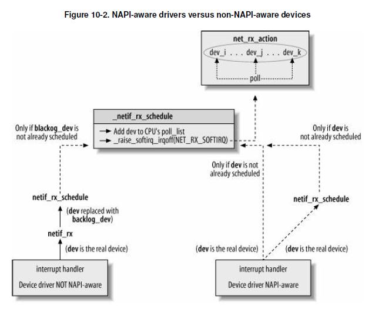

Linux Kernel之*帧的接收*
=======================

> 本文的目的是通过重读《ULNI》和目前的Kernel实现（4.x）重温网络部分帧的接收流程。虽然大部分内容都在《ULNI》中都有，毕竟2.6.12版本的Kernel已经有些年头了，书中有些地方和现在的实现会有些出入（例如`napi_struct{}`的引入，`softnet_data{}`的改变等）。借次机会再次复习复习总不会错 :-)

* [Kernel和NIC的交互](#irq-poll)
* [中断、下半部和软中断](#IRQ-BH)
  - [硬件中断](#hardware-IRQ)
  - [下半部](#bottom-Half)
  - [网络代码和SoftIRQ](#net-softirq)
* [数据结构](#data-struct)
  - [per-CPU结构：softnet_data](#softnet_data)
  - [softnet_data初始化](#sd-init)
  - [New API结构：napi_struct](#napi_struct)
* [NAPI框架和新、旧驱动程序](#napi-framework)
  - [NAPI相关函数](#napi-api)
  - [netif_rx函数](#netif_rx)
* [下半部：net_rx_action](#net_rx_action)
* [使用NAPI的设备](#napi-dev)
  - [e100初始化和打开](#e100-init-open)
  - [e100中断处理函数](#e100-intr)
  - [e100的轮询](#e100-poll)
* [使用netif_rx的设备（Non-NAPI）](#non-napi-dev)
* [入口帧的处理：netif_receive_skb](#netif_receive_skb)

<a id="irq-poll"/>
### Kernel和NIC的交互

帧接收的过程中Kernel和网络设备的交互方式分为*中断（interrupting)*和*轮询(polling)*。

* **轮询方式**

采用Polling的方式，可以定期检查设备寄存器，如果指示有数据，就连续将数据读出。连续读取多个帧的目的在于提高吞吐量（一次轮询只读取一个帧也太低效了）。不过polling会浪费CPU周期，Polling的另一个问题是会造成一定的延迟（从NIC收到数据开始到下次轮询之间会有间隔，最差情况会造成一个轮询间隔（interval）的延迟）。

* **中断方式**

如果要保证低延迟（laytency）则可以考虑中断的方式，保证一有数据就立即通知CPU，然后中断处理函数读取数据帧，存放到输入队列，再通知内核。很显然如果每一帧都触发一个中断，会使得在高负载的情况下CPU忙于中断的处理，无法处理其他任务。考虑到硬件中断的优先级非常高，还会造成输入队列被排满没有机会的情况。

* **中断中处理多个帧**（旧式网络接收）

一种改进的方案是在`一个中断中处理多个帧`。也就是说，当收到一个中断后检查寄存器，如果有数据则持续收取直到收完所有数据，或者达到一个给定的数目（配额）后停止，显然不能因为有数据中断处理就一直不返回。一些旧式的驱动（例如使用`netif_rx()`）的驱动采用了这个模式。

>一个使用这种（旧式或netif_rx()式）方案的例子是3com的3c59x.c驱动，可以参考《ULNI》或者直接查看源码driver/net/ethernet/3com/3c59x.c。

这里只需要理解此类设备如何在一次中断中处理多个帧，先不深入到`vortex_rx()`和`netif_rx()`的实现细节和输入队列等其他话题。

* **中断与轮询结合（NAPI）**

不过更好的方式是中断和轮询的组合（称为New-API，napi方式）。NIC检测到有数据接收通过中断通知Kernel，中断处理函数并不分配skb和读取数据帧，而是将设备（早期是`net_devivce{}`本身现在是相关的napi_struct{}）排入队列，然后触发`下半部（bottom-half，BH)`（例如软中断），由下半部异步的方式负责轮询设备一次读取完所有数据或到达配额上限。

<a id="IRQ-BH"/>
### 中断、下半部和软中断

<a id="hardware-IRQ"/>
#### 硬件中断

我们知道中断是为了及时响应外部事件，而一旦处于*中断上下文（interrupt context）*中，

* 该CPU的其他中断会被关闭（硬中断hardware IRQ不能嵌套）
* CPU也不能执行其他的进程

总之，（硬）中断是不能被抢占的（nonpreemptible），也是不可重入的（non-reentrant），这样就能降低竞争条件的发生；这同时也意味着，中断处理函数的工作应该尽快完成。

<a id="bottom-Half"/>
#### 下半部（Bottom-Half，BH）

于是中断处理过程被分为“上半部top-half”和“下半部bottom-half”，上半部在中断上下文中执行，下半部则“以异步的方式完成特定的请求”。这样就能把硬中断关闭的时间大幅减少，避免因为上半部执行时间过长而丢失任何数据和信息。

下半部的解决方案有，

* 软中断（SoftIRQ）
* 微任务（tasklet）
* 内核线程（kthread）
* 工作队列（work-queue)

前两者不依赖进程环境，可用于执行“不可休眠的任务”；后两个依赖于进程环境，执行期间可以休眠。

软中断和微任务都是通过softirq框架实现，它们在并发和上锁上有一些差异，而且软中断的数目（类型）是设计编码时决定的（如`HI_SOFTIRQ`，`NET_RX_SOFTIRQ`等）；微任务基于软中断实现，但可以动态添加不同的task。软中断（包括tasklet）所执行的机会有很多，例如，

1. 硬中断处理函数(do_IRQ)的末尾，重新打开CPU的中断后，会执行Pending的软中断，这也意味着软中断是可以被硬中断所抢占的。
2. 从中断和异常事件，系统调用返回
3. 在CPU上重新打开软中断
4. 内核线程`run_ksoftirqd()`。如果其他地方都没机会，至少会在这执行一把（也算是兜底？）。命令`ps -e | grep softirq`可以找到per-CPU的softirq线程。

>考虑到主题是帧的接收以及篇幅限制，软中断和其他下半部的话题可参考《ULNI》《LDD3》等。

<a id="net-softirq"/>
### 网络代码和SoftIRQ

网络子系统的初始化函数`net_dev_init()`会“注册”两个网络相关的软中断，一个用于发送处理，一个用于接收。

```c++
static int __init net_dev_init(void)
{
    ... ...
    open_softirq(NET_TX_SOFTIRQ, net_tx_action);
    open_softirq(NET_RX_SOFTIRQ, net_rx_action);
    ... ...
}
```

> `net_dev_init()`在系统初始化（boot）期间被调用，系统初始化和宏`subsys_initcall`相关的议题见《ULNI》。

<a id="data-struct"/>
### 数据结构

<a id="softnet_data"/>
#### per-CPU结构： softnet_data{}

网络数据接收中一个非常重要的数据结构是per-CPU变量`softnet_data{}`，简称`sd`。使用Per-CPU变量可以避免上锁提高并发率和吞吐量。新版的`sd`比ULNI中的定义（2.6.12版本内核）复杂了不少，

```c++
// net/core/dev.c
DEFINE_PER_CPU_ALIGNED(struct softnet_data, softnet_data);

// include/linux/netdevice.h
struct softnet_data {
    struct list_head    poll_list;     // 需要ingress轮询的dev列表，“设备”用相关的napi_struct表示
    struct sk_buff_head process_queue; // 用于Non-NAPI设备，旧式积压队列，函数process_backlog()把
                                       // skb从sd->input_pkt_queue装异到此处，再进行收取

    /* stats */
    unsigned int        processed;
    unsigned int        time_squeeze;
    unsigned int        cpu_collision;
    unsigned int        received_rps;
    // ... RPS 和 Net FLOW ...
    struct Qdisc        *output_queue;     // TX队列规则
    struct Qdisc        **output_queue_tailp;
    struct sk_buff      *completion_queue; // 完成TX可以释放的skb
    
#ifdef CONFIG_RPS
    // ... ...
#endif
    unsigned int        dropped;         // 丢包统计，例如队列已满
    struct sk_buff_head input_pkt_queue; // 用于Non-NAPI设备，驱动分配skb，读取数据，把skb放入该队列
    struct napi_struct  backlog;         // 用于Non-NAPI设备，2.6.12时是 struct net_device backlog_dev;
    
};  
```

> 其中的某些字段和`Receive Packet Steering(RPS)`，RPS通过将接收分组分发到不同的CPU队列进行并发除了而提高PPS，http://lwn.net/Articles/328339/。

说明一下旧式的设备驱动指调用`netif_rx()`的设备或者`non-NAPI`设备。先来看看non-napi设备相关的字段，

* `sd.input_pkt_queue`

该队列仅用于non-napi设备。non-API设备会在驱动程序中（往往是中断处理函数）分配skb，从寄存器读取数据到skb，然后调用`netif_rx()`把`skb`排入`sd->input_pkt_queue`。注意，所有non-napi设备共享输入队列，即per-CPU的`sd->input_pkt_queue`。

* `sd.backlog`

用于non-napi设备，为了和NAPI接收架构兼容，所有的non-napi设备使用一个伪`napi_struct`，即这里的`sd.backlog`。NAPI设备把自己的napi_struct{}放入`sd->poll_list`，而所有的non-napi设备在`netif_rx`的时候把`sd->backlog`放入`sd->poll_list`。稍后看到napi架构的下半部（软中断处理）函数`net_rx_action`依次取出排列到`sd->poll_list`的`napi_struct{}`结构，并使用`napi_poll`轮询配额的数据（或不足配额的所有数据）。

`sd.backlog`是一个内嵌的结构，所有non-napi设备共享它。而它的`sd.backlog.poll`(即`napi.poll`)被初始化为`process_backlog()`，通过这种“共享的伪`napi_struct{}`”方式使得non-napi设备很好的融入了NAPI框架，使得*non-napi*和*NAPI设备*对下半部（`net_rx_action()`）是透明的。不得不说，这是一个值得学习的精巧设计，让我们知道如何向前兼容旧的机制，如何让下层的变化对上层透明。

* `sd.process_queue`

刚才已经提到，non-napi设备把skb放入`sd.input_pkt_queue`，然后在下半部处理中使用`sd.backlog.poll`即`proces_backlog()`函数来处理skb。改函数模拟了NAPI驱动的poll函数行为。作为对比，NAPI设备的poll从设备私有队列读取。Non-NAPI的process_backlog()函数则从non-napi设备共享的输入队列input_pkt_queue中读取配额的数据。然后放入sd.process_queue。

然后是一些通用的字段，

* `sd.poll_list`

NAPI设备在中断处理函数中将其`napi_struct{}`放入该队列，调度软中断soft-IRQ，稍后有下半部`net_rx_action()`负责轮询该设备。

> 原本可以忽略本段注释，不过考虑到ULNI使用了旧的内嵌结构`sd.backlog_dev`为了避免阅读时的误解，需要在此说明一下，该字段在2.6.12中的定义是`struct net_device backlog_dev;`。而随着`napi_struct{}`的引入而修改为此。就是说`sd.backlog.poll`原来是`sd.backlog_dev.poll`。

<a id="sd-init"/>
#### softnet_data初始化

per-CPU数据`softnet_data`也在`net_dev_init()`中初始化，注意non-napi使用的`sd.backlog`的初始化设置了统一的poll函数`process_backlog`和配额。

```c++
static int __init net_dev_init(void)
{
    ... ...
    for_each_possible_cpu(i) {
        struct softnet_data *sd = &per_cpu(softnet_data, i);

        skb_queue_head_init(&sd->input_pkt_queue);
        skb_queue_head_init(&sd->process_queue);
        INIT_LIST_HEAD(&sd->poll_list);
        sd->output_queue_tailp = &sd->output_queue;
        ... RPS ...

        sd->backlog.poll = process_backlog;
        sd->backlog.weight = weight_p;
    } 
    ... ...   
}
```

<a id="napi_struct"/>
#### New API结构: napi_struct{}

虽然NAPI很早就已经引入了Kernel，近来kernel将NAPI部分又进行了一定的抽象，定义了`napi_struct{}`。net_device中原来的`dev->poll_list`, `dev->quota`, `dev->weight`也剥离到了`napi_struct{}`中集中处理。

```C++
// include/linux/netdevice.h
/*
 * Structure for NAPI scheduling similar to tasklet but with weighting
 */    
struct napi_struct {
    /* The poll_list must only be managed by the entity which
     * changes the state of the NAPI_STATE_SCHED bit.  This means
     * whoever atomically sets that bit can add this napi_struct
     * to the per-cpu poll_list, and whoever clears that bit
     * can remove from the list right before clearing the bit.
     */
    struct list_head    poll_list;     // sd->poll_list元素

    unsigned long       state;         // NAPI_STATE_XXX
    int         weight;                // 每个NAPI实体试用的配额
    unsigned int        gro_count; 
    int         (*poll)(struct napi_struct *, int);
    ... netpoll ...
    struct net_device   *dev; 
    struct sk_buff      *gro_list; 
    struct sk_buff      *skb; 
    struct hrtimer      timer;
    struct list_head    dev_list;  
    struct hlist_node   napi_hash_node;
    unsigned int        napi_id;   
};

enum { 
    NAPI_STATE_SCHED,   /* Poll is scheduled */
    NAPI_STATE_DISABLE, /* Disable pending */
    NAPI_STATE_NPSVC,   /* Netpoll - don't dequeue from poll_list */
    NAPI_STATE_HASHED,  /* In NAPI hash */
};

```

> NETPOLL则提供了紧急情况下使用通过硬件polling的方式使用网络设备，可以使用它实现netconsole, kgdb-over-ethernet等。

两个概念要提一下：`预算（buget）`和`权重（weight）`。`预算`代表了所有要轮询的设备，在一次软件中断中，总共能够处理的帧的输入；限制预算的原因是放在软中断占用CPU时间过长而影响其他进程和软中断（硬件中断不受影响）。除了现在总预算外，为了公平起见，对每个设备也需要分配一定的`权重（weight）`，限制每个设备最大的帧读取量。之前版本的Kernel还有个`配额（quota）`的概念，那时配额代表了设备能够一次性读取的最多帧，而权重（weight）只是quota的增幅。新版的Kernel则直接使用weight。

> 之前已经提到过，最早引入NAPI（Kernel 2.5）的时候，在`net_device{}`加入了`poll`, `poll_list`, `quota`, `weight`几个字段，随着后来`napi_struct{}`的引入，现在它们都被移动到了`napi_struct{}`中（quota被去除了）。

<a id="napi-framework"/>
### NAPI框架和新、旧驱动程序

ULNI的一张图很好的诠释了NAPI框架和新、旧驱动程序直接的关系。不过新版的Kernel更新了一些napi相关函数，netif_rx()实现也和以前有很大不同。

<div align=center></div>

<a id="napi-api"/>
#### NAPI的API

先来看看NAPI系列API，

* `napi_schedule/____napi_schedule`

`napi_schedule`完成RX的调度工作，它原来叫做`netif_rx_schedule`，而它是____napi_schedule()的包裹函数。函数`____napi_schedule()`（原来叫做`__netif_rx_schedule()`）。它的作用是，

1. 把`napi设备`的`napi`结构（对于non-napi设备则是`sd->backlog`）放入设备轮询队列：`sd->poll_list`。
2. 调度软中断NET_RX_SOFTIRQ

如图上所示，NAPI设备驱动一般会直接调用该函数（或变体），而non-napi设备则是通过netif_rx()来调用它。

* `napi_complete/__napi_complete`

当设备驱动（sd->poll，例如e100_poll）完成了对所有接收数据的轮询，就需要把设备（的napi）从sd->poll_list移除，移除过程通过napi_complete或其变体。

* `netif_napi_add`

NAPI驱动程序调用该函数设置自己的poll，和权重，此外该函数会初始化设备的napi_struct包括state等。NIC驱动调用该函数的时候，它会把NIC的napi结构放入dev.napi_list以备使用，注意不是放入sd.poll_list那是有数据要轮询才使用的设备列表。

```C++
void netif_napi_add(struct net_device *dev, struct napi_struct *napi,
            int (*poll)(struct napi_struct *, int), int weight)
{
    INIT_LIST_HEAD(&napi->poll_list);
    ... ...
    napi->timer.function = napi_watchdog;
    ... ...
    napi->skb = NULL;
    napi->poll = poll;
    if (weight > NAPI_POLL_WEIGHT)  // 权重的设置不能过大
        pr_err_once("netif_napi_add() called with weight %d on device %s\n",
                weight, dev->name);            
    napi->weight = weight;    
    list_add(&napi->dev_list, &dev->napi_list);
    napi->dev = dev;
    ... ...
    set_bit(NAPI_STATE_SCHED, &napi->state);
}
```

<a id="netif_rx"/>
#### netif_rx函数

`netif_rx()`在中断上下文中执行，因此它执行期间关闭CPU的中断，工作完成重新打开。新版的netif_rx实现相对以前简化了许多，尤其是`netif_rx()`不再有拥塞管理部分。
不考虑RPS，netif_rx函数的工作最终由`enqueue_to_backlog`完成。后者的逻辑非常简单，

1. 如果设备的输入队列未被开启（通过测试dev.state是否设置__LINK_STATE_START，输入没有特定的标记）
1. 如果队列中没有其他数据，先通过`____napi_schedule()`调度NAPI（把`sd.backlog`放入`sd.poll_list`然后调度SoftIRQ）
2. 把skb放入`sd.input_pkt_queue`尾部（在队列未满或者流控允许的情况下）

队列为空要先调度SoftIRQ的原因是，这时non-api共享的`sd.backlog`可能都不在`sd.poll_list`中。因为netif_rx()的执行环境是中断上下文，调度SoftIRQ后它不会被立即执行。

```c++
static int enqueue_to_backlog(struct sk_buff *skb, int cpu, 
                  unsigned int *qtail)
{
    ... ...
    sd = &per_cpu(softnet_data, cpu);

    local_irq_save(flags);

    rps_lock(sd);
    if (!netif_running(skb->dev))
        goto drop;
    qlen = skb_queue_len(&sd->input_pkt_queue);
    if (qlen <= netdev_max_backlog && !skb_flow_limit(skb, qlen)) {
        if (qlen) {
enqueue:
            __skb_queue_tail(&sd->input_pkt_queue, skb);
            input_queue_tail_incr_save(sd, qtail);
            rps_unlock(sd);
            local_irq_restore(flags);
            return NET_RX_SUCCESS;
        }    

        /* Schedule NAPI for backlog device
         * We can use non atomic operation since we own the queue lock
         */
        if (!__test_and_set_bit(NAPI_STATE_SCHED, &sd->backlog.state)) {
            if (!rps_ipi_queued(sd))
                ____napi_schedule(sd, &sd->backlog);
        }    
        goto enqueue;
    }    

drop:
    ... ...
    return NET_RX_DROP;
}

```

<a id="net_rx_action"/>
### 下半部：net_rx_action

`net_rx_action`是软中断`NET_RX_SOFTIRQ`的处理函数。它把`sd->poll_list`中所有设备（对应的napi结构）取出来，依次处理。如果因为总预算超过而未能被轮询的设备，其`napi`结构要重新被加入`sd->poll_list`尾端。此外还有一种情况，就是设备本身的权重被用完了，它们也要再次被加入`sd->poll_list`等待下次`NET_RX_SOFTIRQ`被调度。

最后，不论是总预算还是某些设备weight耗尽的关系，本次执行未能完成所有设备及其所有数据的接收，需要重新调度`NET_RX_SOFTIRQ`。

```c++
static void net_rx_action(struct softirq_action *h)
{
    struct softnet_data *sd = this_cpu_ptr(&softnet_data);
    unsigned long time_limit = jiffies + 2; 
    int budget = netdev_budget;
    LIST_HEAD(list);   // 待轮询的所有设备，包括了预算用完后未被轮询到的设备
    LIST_HEAD(repoll); // 记录那些因为自己的权重配额被而需要下次轮询的设备。

    // 先把所有设备(napi)从poll队列中取出来，如果buget超限，剩下的设备会再次放入尾端。
    local_irq_disable();
    list_splice_init(&sd->poll_list, &list);
    local_irq_enable();

    // 遍历每个设备的napi，直到所有设备都处理完，或者预算用完
    for (;;) {
        struct napi_struct *n;

        if (list_empty(&list)) {
            if (!sd_has_rps_ipi_waiting(sd) && list_empty(&repoll))
                return;
            break;
        }    

        n = list_first_entry(&list, struct napi_struct, poll_list);
        budget -= napi_poll(n, &repoll); // 由设备的->poll自己确认是不是数据已经全部读取或者权重用完了

        // 预算已经用完了
        /* If softirq window is exhausted then punt.
         * Allow this to run for 2 jiffies since which will allow
         * an average latency of 1.5/HZ.
         */
        if (unlikely(budget <= 0 || 
                 time_after_eq(jiffies, time_limit))) {
            sd->time_squeeze++;
            break;
        }    
    }    

    local_irq_disable();

    // 以下设备要重新被放入sd->poll_list
    // 1. 因为预算用完，list中尚未处理的设备，
    // 2. 或者设备本身权重用完而被放入repoll的设备
    list_splice_tail_init(&sd->poll_list, &list);
    list_splice_tail(&repoll, &list);
    list_splice(&list, &sd->poll_list);

    // 不论是总预算还是设备weight的关系，本次执行未能完成所有设备及其所有数据的接收，重新调度NET_RX_SOFTIRQ
    if (!list_empty(&sd->poll_list))
        __raise_softirq_irqoff(NET_RX_SOFTIRQ);

    net_rps_action_and_irq_enable(sd);
}

```
<a id="napi-dev"/>
### 使用NAPI的设备

ULNI提到那个时代使用NAPI的驱动并不多，但现在情况已经不同了。除了新驱动使用NAPI，原本使用netif_rx的Intel e100也加入了NAPI的阵营。我们以e100为例看看NAPI设备帧的接收过程。帧的接收从NIC的中断开始，中断处理函数在中断上下文运行。e100的中断处理函数为`e100_intr()`。

<a id="e100-init-open"/>
#### e100初始化和打开

我们只关注e100初始化过程中和数据接收相关的部分，主要是NAPI和中断处理函数部分。PCI和网络设备初始化和网络设备打开等详细讨论见ULNI。

e100是PCI 网卡，网络设备包括e100的驱动，以Kernel模块方式编写。模块初始化（链接到Kernel或者动态加载）的时候，注册PCI driver，当PCI自动扫描到设备的时候driver的probe函数，也就是e100_probe就会被调用。e100_probe()分配net_device{}，注册网络设备。同时也会注册napi.poll，设置权重，netif_napi_add会初始化相关的napi结构设置相应字段，并将其加入&dev->napi_list待稍后使用，之前已经提到过了。

```c++
static int e100_probe(struct pci_dev *pdev, const struct pci_device_id *ent)
{
    ... ...
    netif_napi_add(netdev, &nic->napi, e100_poll, E100_NAPI_WEIGHT);
}
```

另一方面使用设备前要打开该设备，用户通过ifconfig或ip命令打开一个设备时dev_open()被调用，它会设置IFF_UP和然后通过NotifyChain通告Kernel的其他模块（或者通过netlink通知应用层）。dev_open会调用dev.ndo_open()。对于e100而言则是e100_probe时注册的e100_open()。e100_open进而调用e100_up()。后者会安装中断处理函数e100_intr()。

```c++
static int e100_up(struct nic *nic)
{       
    ... ...
    if ((err = e100_hw_init(nic)))
        goto err_clean_cbs;
    ... ...
    if ((err = request_irq(nic->pdev->irq, e100_intr, IRQF_SHARED,
        nic->netdev->name, nic->netdev)))
        goto err_no_irq;
    netif_wake_queue(nic->netdev);
    napi_enable(&nic->napi);
    /* enable ints _after_ enabling poll, preventing a race between
     * disable ints+schedule */
    e100_enable_irq(nic);
    return 0;
    ... ...
}

```

<a id="e100-intr"/>
#### e100中断处理函数

e100的中断处理函数e100_intr()。

1. 现实读取状态寄存器
2. 因为中断是共享的，所有共享中断的驱动要判断中断是否是自己的，这点通过寄存器判断
3. 写寄存器应答中断（清除中断）
4. 如果可以的话，使用__napi_schedule调度NAPI，它把e100的napi结构&nic->napi放入sd.poll_list然后调度软中断
5. 在下半部处理完本设备的poll前关闭中断。

NIC中断的关闭不会导致数据丢失，因为数据会被保存到NIC的私有队列中，只是关闭中断不会通知CPU调用处理函数；但是下半部还是会通过轮询的方式把数据从NIC队列中读出。

> NIC一般会有一个FIFO队列，可通过读寄存器或者DMA方式从该队列把数据取出。

稍后NET_RX_SOFTIRQ的处理函数net_rx_action会调用e100的poll函数，

```
static irqreturn_t e100_intr(int irq, void *dev_id)
{
    struct net_device *netdev = dev_id;
    struct nic *nic = netdev_priv(netdev);
    u8 stat_ack = ioread8(&nic->csr->scb.stat_ack);

    netif_printk(nic, intr, KERN_DEBUG, nic->netdev,
             "stat_ack = 0x%02X\n", stat_ack);

    if (stat_ack == stat_ack_not_ours ||    /* Not our interrupt */
       stat_ack == stat_ack_not_present)    /* Hardware is ejected */
        return IRQ_NONE;

    /* Ack interrupt(s) */
    iowrite8(stat_ack, &nic->csr->scb.stat_ack);

    /* We hit Receive No Resource (RNR); restart RU after cleaning */
    if (stat_ack & stat_ack_rnr)
        nic->ru_running = RU_SUSPENDED;

    if (likely(napi_schedule_prep(&nic->napi))) {
        e100_disable_irq(nic);
        __napi_schedule(&nic->napi);
    }    

    return IRQ_HANDLED;
}

```

<a id="e100-poll"/>
#### e100的轮询

<a id="non-napi-dev"/>
### 使用netif_rx的设备（Non-NAPI）


<a id="netif_receive_skb/>
### Ingress帧的处理：netif_receive_skb


