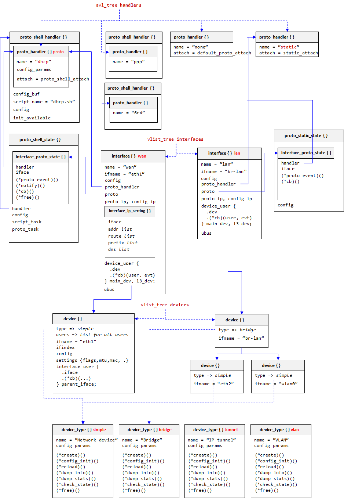
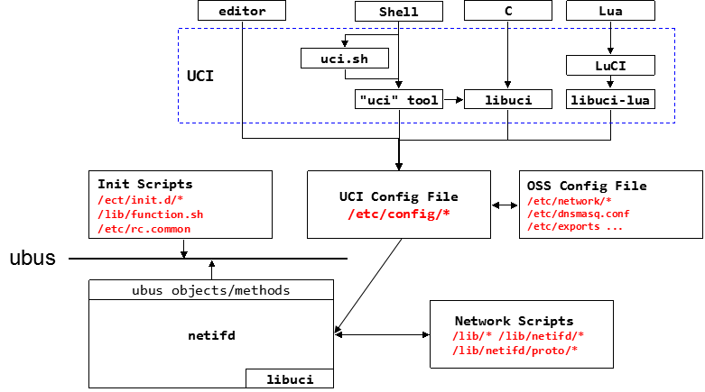

OpenWRT之网络管理 - *netifd*
========================

* [netifd对象概述](#object)
  - [设备对象 device{}](#device)
  - [接口对象 interface{}](#interface)
  - [协议处理对象 proto_handler{}](#protocol)
  - [对象关系图](#objects-pic)
* [netifd架构](#arch)
  - [UCI和配置文件](#uci)
  - [修改配置](#config-modify)
  - [netifd ubus接口](#ubus)
  - [网络协议脚本](#network-script)
  - [参考文档](#config-doc)

<a id="object" />
netifd对象概述
------------

<a id="device" />
#### 设备对象 `device{}`

netifd内部对象分为3个层次： `device{}`, `interface{}` 和 `protocol{}`。`device{}`是最底层，可以表示物理网络接口（例如 *eth0*），也可以是一些虚拟设备（bridge, vlan, tunnel, binding等）。Netifd各`device{}`类型的可以和Linux的网络设备和虚拟网络设备模型进行类比。

其他任何对象如果对某个`device{}`的状态改变感兴趣，可以注册自己的callback，也就是我们说所的“订阅-发布”机制。从该机制的实现来看，`device{}`对象维护了一个`device_user{}`列表`device.users`，用来记录消息订阅方的cb，以及对哪些event感兴趣。不同的订阅者感兴趣的`device{}`事件不同。同时`device.users`充当`device{}`引用计数的功能，当所有对`device{}`的引用，即`device_user{}`，被删除后`device{}`也会被释放。不存在孤立、没有人引用的`device{}`。

>*注：订阅者并不能实时订阅，而是将device_user{}硬编码到其结构中。就是说谁对`device{}`感兴趣，是设计时约定的。被没有注册“订阅”的函数。*

除了高层对象（如`interface{}`）对`device{}`的引用，`device{}`对象之间也可以相互引用，例如网桥设备（type为'bridge'的`device{}`）可以应用其网桥端口设备。打个比方，网桥设备*br-lan*有两个网桥端口，它们分别是物理接口*eth0*和*wifi0*，那么*br-lan*的`device{}`就会同时引用eth0和wifi0的`device{}`；vlan也有类似的上下级引用。这点和Linux的master/slave设备关系类似。

因为`device{}`会被多方引用，它的up/down状态也通过refcount管理。调用`claim_device()`将设备打开(*brough up*)；调用`release_device()`将设备关闭(*brough down*)，它们都会操作引用计数。而实际的操作，例如关闭，只有当up/down引用计数为0的时候，才会正真的关闭设备。

值得注意的是`device{}`对象的存在，并不代表它是可见的（`device.sys_present`标记了是否系统范围内available）。而其他对象可以在`device{}`可见之前就attach它，并且等待其可见的event (`DEV_EVENT_ADD`)。

设备的状态变迁会通知所有订阅者(`device_user{}`)，设备支持的event如下，

  * DEV_EVENT_ADD

    设备对系统可见（*available*）。如果已经有人关注过改设备(某个对象持有的`device_user{}`被添加到`device.users`)就会立刻发送该事件。

  * DEV_EVENT_REMOVE

    设备不再对系统可见（*not available*），收到改事件后，所有的user需要释放释放了设备的引用并完成相关状态的清理。

  * DEV_EVENT_SETUP

    设备即将被打开（*brought up*）,设备的用户可以借此机会对它进行low-level的配置工作。

  * DEV_EVENT_UP

    设备被成功打开。

  * DEV_EVENT_TEARDOWN

    设备即将被关闭。

  * DEV_EVENT_DOWN

    设备被成功关闭。

  * DEV_EVENT_LINK_UP *(optional)*

    链路建立。

  * DEV_EVENT_LINK_DOWN *(optional)*

    链路断开。

<a id="interface"/>
#### 接口对象 `interface{}`

接口`interface{}`被用来表示high-level的配置信息（例如IP地址等L3信息），这些配置会被应用到一个或多个`device{}`上。一个`interface{}`必须绑定到一个*主设备*和一个*layer3设备*。通常，如果配置(*setup*)过程比较简单，例如static或者DHCP，那么*主设备*和*layer3设备*是同一个(`device{}`)实例。而复杂协议，诸如ppp/pptp和VPN，则需要将*l3设备*映射成另一个设备实例。

和`device{}`类似，`interface{}`提供（*fixed的*）“订阅-发布”机制通告感兴趣的“用户”其状态的变化。`interface{}`支持的状态变化事件较少，

  * IFS_SETUP

    接口正在被protocol handler（`protocol{}`对象）配置。

  * IFS_UP

    接口被成功配置。

  * IFS_DOWN

    接口被关闭。

<a id="protocol"/>
#### 协议处理对象 `proto_handler{}`

协议handler可以被attach到任何对象，只要对方提供状态改变的callback。通常`proto_handler{}`被attach到`interface{}`。

`proto_handler{}`的实例只是静态的一组对象，分别描述了不同的协议，例如static，DHCP，PPP，它们通常是内置的。而通过协议动态配置接口的时候，并不会生成同一协议的多个`proto_handler{}`实例，而是以其为模板，生成运行时协议状态。为此，提供了协议处理运行时对象`interface_proto_state{}`用来保存（某个`interface{}`）相关的协议处理过程和状态。

>不过`interface_proto_state{}`也只是个基类，一般会使用一个继承自（C的做法是包含）它的类来表示协议配置过程和状态。

不论采用何种协议，static也好DHCP也罢，`proto_handler{}`会调用外部脚本，或者程序，通常是调用外部Shell脚本（而Shell脚本再调用其他程序，例如udhcpc），外部脚本、程序，需要响应来着netifd（`proto_handler{}`）的3个命令：

  - PROTO_CMD_SETUP
  - PROTO_CMD_RENEW
  - PROTO_CMD_TEARDOWN

通常命令以异步的方式执行。为此需要，外部脚本、程序回复以下事件作为对命令执行的结果：

  - IFPEV_UP
  - IFPEV_DOWN
  - IFPEV_LINK_LOST
  - IFPEV_LINK_RENEW

>*注：可能最初受到DHCP协议处理的影响，处理DHCP的外部脚本（及相关程序）异步执行，总是应该响应上面3个命令，以及回复上述的事件。*

当然，如果命令的速度足够快，例如静态配置，可以直接在相应函数中返回上述事件。免去命令、事件的交互过程。这时需要设置PROTO_FLAG_IMMEDIATE标记，以免发起IFPEV_UP/DOWN等事件的传输，直接在核心代码中处理配置过程。

<a id="objects-pic"/>
#### 对象关系图

<!--  -->
<div align=center></div>

<a id="arch" />
netifd架构
------------

暂时跳出关乎内部实现的各种对象，从外部看看netifd如何与其他模块的关联，主要是如何对它进行配置。这里先给出一张图，好有个基本的概念。

<div align=center></div>

遵循Unix的惯例，初始化（启动、停止）脚本放在`/etc/init.d/*`下面，配置文件放在`/etc/config/*`(Unix通常是/etc/xxx.conf或/etc/xxx/xxx.conf)。而一些执行协议任务的网络脚本放在`/lib/netifd/proto/*`下，并引用了`/lib/*`和`/lib/netifd/*`下其他的脚本和库。


<a id="uci" />
#### UCI和配置文件

OpenWRT有统一的配置接口UCI，UCI提供了库（*libuci*）、工具（*uci*）和Lua语言接口（LuCI），上层用户程序通过UCI以各种方式访问OpenWRT的配置。另外，UCI采用统一的配置文件系统(`/etc/config/*`)，以免各个模块使用自定义的配置，方便统一管理。OpenWRT作为一个系统，保持风格一致，便于提供一致的接口和系统性范围的操作（Factory Resetd等）。我们知道，各种OpenSource软件采用不同风格的配置文件，UCI配置文件系统对各个OpenSource配置文件的封装和抽象。

netifd程序初始化的时候（利用libuci）加载`/etc/config/network`文件，其内容如下所示（*wireless配置略*），

```bash
root@OpenWrt:/# cat /etc/config/network

config interface 'loopback'
        option ifname 'lo'
        option proto 'static'
        option ipaddr '127.0.0.1'
        option netmask '255.0.0.0'

config interface 'lan'
        option ifname 'eth0'
        option type 'bridge'
        option proto 'static'
        option ipaddr '192.168.1.1'
        option netmask '255.255.255.0'
        option ip6assign '60'

config interface 'wan'
        option ifname 'eth1'
        option proto 'dhcp'

... ...
```

配置文件分成若干section，section以关键字"config"所在行开头，config后面跟section类型和名字，例如上面的配置包含了3个'interface'类型的section，名字分别是'loopback', 'lan'和'wan'。netifd一边解析配置文件，一边构建其内部的数据结构（对象），根据上述配置，就会建立其3个`interface{}`对象和它相关的`device{}`对象。不过并非所有对象都在解析配置文件的时候建立，`proto_handler{}`可能是内置的；而`interface_proto_state{}`则运行时建立。

<a id="config-modify" />
#### 修改配置

配置OpenWRT网络部分（不仅仅是负责接口和配置管理的netifd，还包括wireless和switch等部分）的一般步骤为：

1. 通过UCI修改配置文件`/etc/config/network`。其实怎么修改都行，手动修改，使用uci工具，通过连接uci系统的WebUI等方法，随意。
2. 通过初始化脚本（*init-script*） `/etc/init.d/network restart|reload`重启或重新加载netifd。

restart会导致网络部分包括netifd整个被重启和重新初始化。如果只是reload，那就只需要通知netifd查看和应用修改的参数。命令的传递通过OpenWRT的另一个基础设施，负责RPC的ubus完成。

<id ="ubus" />
#### netifd ubus接口

通过`ubus`命令，可以查看netifd都提供了哪些服务，我们可以看到系统里所有的服务（ubus对象），而network开头的便是由netifd对外提供的。这些服务（ubus对象）的接口（方法）和参数可以通过`-v`选项查看。

```bash
root@OpenWrt:/# ubus list 
dhcp
log
network
network.device
network.interface
network.interface.lan
network.interface.loopback
network.interface.wan
network.interface.wan6
network.wireless
service
system
```

network对象（指network对象本身，不包括其子对象network.interface等，子对象有自己的方法）的方法包括，

|method|description|
|:------:|-----------|
|restart|重启netifd|
|reload|重新载入配置，并应用修改过的部分|
|add_host_route|添加Host路由，从名字和参数来看，并不能随意添加各种其他类型的路由|
|get_proto_handlers|获取所支持的协议static、DHCP、PPP、DS-Lite、GRE等等和它们接受的参数
|add_dynmic|运行时动态添加接口|
|del_dynmic|运行时动态删除接口|

```bash
root@OpenWrt:/# ubus list -v network
'network' @0747e9c2
        "restart":{}
        "reload":{}
        "add_host_route":{"target":"String","v6":"Boolean","interface":"String"}
        "get_proto_handlers":{}
        "add_dynamic":{"name":"String"}
        "del_dynamic":{"name":"String"}

```

可见init-script便是通过ubus RPC对netifd network对象的操作，完成网络管理（和其他）部分的restart和reload。

而接口对象`network.interface`支持了其他一些method，打开关闭等皆可通过ubus命令查看，可通过命令查看，不在累述。

<a id="network-script" />
#### 网络协议脚本


<a id="config-doc" />
#### 参考文档

关于UCI和各个配置文件的详细介绍，可参考OpenWRT官方文档，

 - http://wiki.openwrt.org/doc/techref/uci
 - http://wiki.openwrt.org/doc/techref/initscripts
 - http://wiki.openwrt.org/doc/devel/config-scripting
 - http://wiki.openwrt.org/doc/devel/network-scripting
