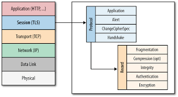
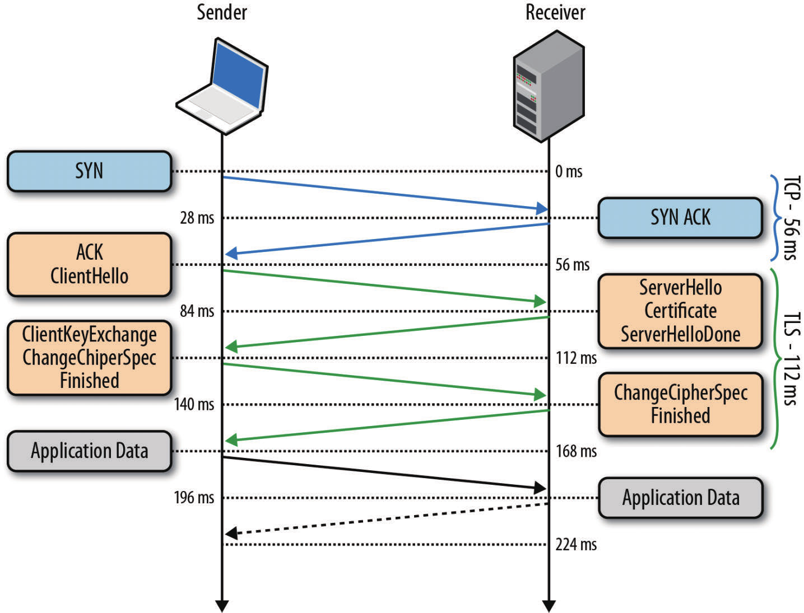
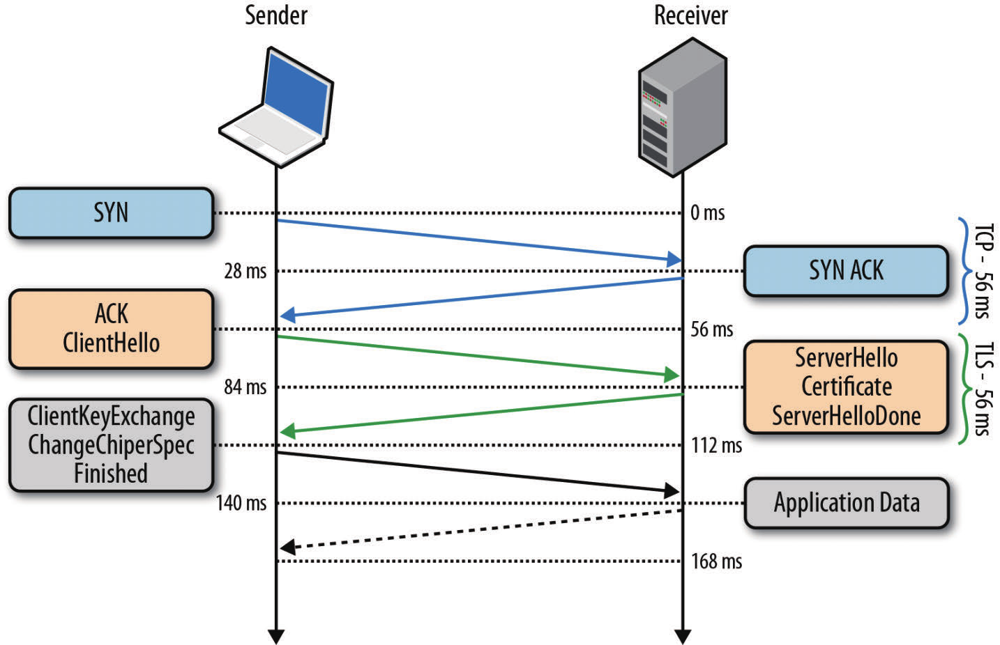

Web性能权威指南　笔记
==================

Ch1. 延迟与带宽
-------------

# **延时** 构成

* 传播延迟：　信号传播速度，距离的函数，不超过光速．
* 传输延迟：　bits转移到链路的时间，*消息长度* 和 *链路速率* 的函数 (Transmit, TX)
* 处理延迟：　处理分组首部，检查位错误，确定分组目标 (processing)
* 排队延迟：　排队等待处理的时间 (queuing)，路由器,网卡分组队列等

# 光速与传播延时

光速与介质的折射率（铜线，光纤）．纽约到伦敦距离光纤RTT 56ms，纽约到悉尼　160ms．

> CDN：在不能提高传播速度的情况下，缩短服务器与用户的距离．

# 延迟的最后一公里

延迟相当大一部分在最后几公里，而非跨洋产生．*接入* 互联网的路由器节点，需要数十ms把分组传递到ISP的主路由器．光纤接入18ms，Cable接入26ms，DSL 43ms．`traceroute`可反映没跳的耗时．

> traceroute通过　TTL和ICMP Time Exceeded消息实现．或者记录路由．

多数网站的**性能瓶颈是延迟**，而不是带宽!

# 带宽

* 网络核心的带宽
　光纤 一个波长最大容量171G bps，一条光纤400种波长，　共70T　bit/s．海底光缆带宽只使用了20%．
* 网络边缘的带宽
　全球　3.1Mbps, 韩国　14.2 Mbps, 美国　8.6Ｍbps．

> http://speedtest.net

Ch2. TCP的构成
-------------

# TCP三次握手

TCP三次握手，连接双方都需要经历一次完整的RTT才能开始传输数据．

> TCP快速打开(TFO): 降低HTTP事务网络延迟15%．Linux 3.7.

# 拥塞防御与控制

## 流量控制

* 滑动窗口

  - 通告自己的接收窗口`rwnd`

  `优化`：窗口扩大因子选项 `net.ipv4.tcp_window_scaling`

* 慢启动

  `优化`：提高cwnd初始值为10．以更少的RTT尽快达到带宽的极限，对新建连接，大量短连接的应用帮助很大．Linux 2.6.39(最好是2.6.32).

  - 慢启动重启(Slow-Start Restart, SSR)，连接空闲一段时间后，重置cwnd．因为网络情况可能已经发生变化．

  `优化`：关闭`net.ipv4.tcp_window_scaling`

* 拥塞避免

  超过慢启动阀值(`ssthresh`)进入拥塞避免(congestion avoidance)．发生丢包，则sstresh减半，cwnd设置为新的ssthresh并进入拥塞避免．

  TCP流量曲线呈锯齿状．

  TCP Tahoe/Reno
  TCP Vegas/New Reno/BIC/CUBIC/Compound/BBR.

* 快速重传，快速恢复

# 带宽时延积

窗口大小和RTT决定能否填满带宽时延积BDP，高BDP(长肥管道)情况下,默认的接受窗口可能不足，所以需要窗口扩大因子．

#　队首阻塞

某个分组没收到，后续收到的分组不能交付给应用层．(Head of Line, HOL阻塞）．有时不需要按序交付，比如ptp下载，比如每个消息独立（多个HTTP请求），比如每个消息覆盖前一次操作，比如音频，视频．

# 针对TCP的优化建议

* TCP三次握手增加整个RTT
* 慢启动并应用到每个连接
* 流量，拥塞控制影响所有连接吞吐量
* 吞吐量由当前拥塞窗口大小控制

## 服务器配置调优

* 增大TCP的初始化拥塞窗口　（升级内核）cwnd-init为10 Linux 3.2+
* 关闭慢启动重启
* 打开窗口扩大因子选项
* TCP快速打开(TFO)

## 应用程序行为调优

* 能少发就少发(减少冗余数据，压缩数据)
* 如果不能让传输更快，就让传输距离缩短(CDN)
* 重用TCP连接是提升性能的关键

Ch3. UDP的构成
-------------

没有周密的计划和规划，一流的构想也会沦为二流的TCP实现．

# UDP与NAT

## 连接状态超时

TCP有严密的状态机，路由设备可以监控连接状态，根据情况创建删除路由表条目．
UDP没有握手，没有连接终止，没有状态．所以NAT必须保存每个UDP流的信息，只能设置定时器，但是定时多长？可以使用keepalive不断激活NAT设备的计时器．

## NAT穿透

P2P应用需要端到端双向通信

- STUN
- TURN  中继代理
- ICE

# 针对UDP的优化建议

* UDP应用*必须*容忍各种Internet路径条件
* UDP应用*应该*控制传输速度
* UDP应用*应该*对所有流量进行拥塞控制
* UDP应用*应该*使用与TCP相近的带宽
* UDP应用*应该*准备基于丢包的重发机制
* UDP应用*应该*不发送大于PMTU的数据报
* UDP应用*应该*处理报文丢失，重复，乱序
* UDP应用*应该*足够稳定以支持２分钟以上的交付延迟
* UDP应用*应该*支持IPv4 UDP校验和，必须支持IPv6校验和
* UDP应用*可以*在需要时使用keep-alive(最小间隔１５秒)

> WebRTC符合一以上要求.

Ch4. 传输层安全(TLS)
------------------

* 1999: TLS 1.0, 对应SSL 3.0，区别不明显，但影响互操作．
* 2006: TLS 1.1
* 2008: TLS 1.2
* 2018: TLS 1.3

# 加密，身份验证与完整性

* 加密 (Encrypto)
  - 混淆数据的机制．

* 身份验证（Authentication）
  - 验证身份标识有效性的机制

* 完整性（Integration）
  - 检测消息是否被串改或者伪造的机制

### 密钥协商

连接双方需要就加密数据的*密钥套件*和*密钥*进行协商一致．`非对称密钥加密`，不必通信双方实现＂认识＂，且协商过程通过非加密通道完成．

### 身份验证

这个验证需要建立＂认证机构信任链＂(Chain of Trust and Certification Authorities)．

### 消息封装

使用消息验证码(MAC, Message Authentication Code)签署每条消息．MAC是一个单向加密哈希函数，密钥由双方协商确定．发送方发送TLS Record时生成MAC并附加到消息中，接收端通过计算和验证这个MAC值来判断消息的完整性和可靠性．

HTTP:80被各种设备很好的支持，如果脱离它会造成各种异常（比如私有协议，私有选项无法通过中间设备，防火墙）．新的基于HTTP的协议，比如WebSocket, SPDY(HTTP2)基于HTTPS信道，以便绕过中间代理．

# TLS握手

协商：

* TLS版本
* 加密套件
* 验证证书

握手过程，

- 0ms:   完成三次握手的RTT
- 56ms:  Client发送TLS协议版本，所支持的加密套件列表，支持或希望使用的TLS选项
- 84ms:  Server选择TLS版本，加密套件; 附上自己的证书．
　　　　　 可选：发送一个请求，要求Client提供证书及提供TLS扩展参数．
- 112ms: 协商确定版本和加密套件后，客户端生成新的*对称密钥*，用服务器的公钥加密，发送给服务器．
　　　　　 以上，除了加密的对称密钥，其他全是明文．
- 140ms: 服务器用私钥解密出*对称密钥*后，通过验证MAC检验消息完整性，发送一个加密的"Finish"．
- 168ms: 客户端使用之前生成的对称密钥解密Finish，验证MAC．后续开始发送应用数据．

相对TCP握手，还多两次RTT，增加延迟．

# TLS会话恢复

* TLS额外的握手造成**延时**
* 非对称加密的计算两造成**性能损失**

Session回复(共享)，在多个连接共享协商后的安全密钥．

### 会话标识符(Session ID)

1. `Session ID`：服务器创建的32 Byte，并作为`ServerHello`的一部分发送．
　　Server内部，维护Session-ID和协商后的会话参数．包括对称密钥．
2. Client可以保存Session-ID，并用于随后的`ClientHello`.
3. Server需要保证Session-ID的缓存及清除．

这样，节省一次RTT，以及非对称密钥的加,　解密计算．

但是Session-ID对Server内部的维护提出挑战，如何缓存大量的连接信息，如何淘汰不要的连接信息，如何跨服务器共享．

### 会话记录单(Session Ticket)

为解决Session-ID在服务器端维护的问题，提出了`Session Ticket`机制，不需要Server为每个Client维护会话状态．

Server在（第一次）完整的TLS握手最后一次报文交换中，添加一条＂加密过的＂　New Session Ticket，只有Server知道如何解密．

Client收到后保存起来，在后续会话的ClientHello中添加SessionTicket．这样将会话数据保存在客户端．

又称＂无状态恢复＂，但Session Ticket仍要解决负载均衡器多Server的问题，比如所有Server共享密钥．并定期轮换密钥．

# 信任链与证书颁发机构

身份验证流程

# 针对TLS的优化建议

* 非对称加密计算量大：硬件SSL offload(计算集群)　（现在Facebook, Google已经不用专门硬件了）
　硬件的发展使得不需要额外的机器和硬件．
* Session-ID恢复
* Session-Ticket无状态恢复
* 尽量重用TCP连接．
* CDN,代理服务器，缩短距离(一边处理Ｃlient的连接,一边和RS保持TLS长连接池)
